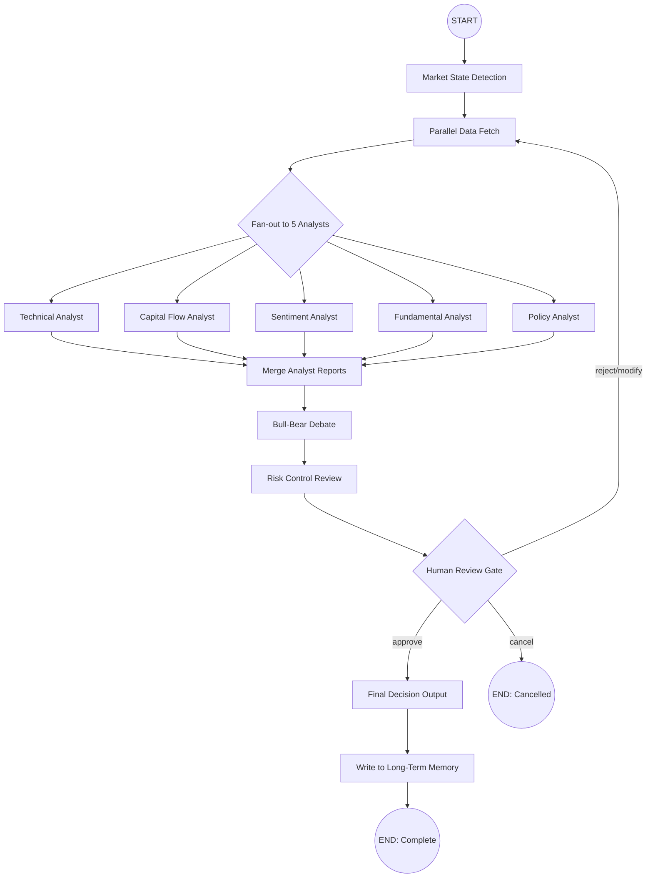

# PA_MCP Agent Decision Layer — Detailed Implementation Plan

**Date:** 2026-07-26
**Version:** 1.0
**Status:** Plan Phase
**Dependency:** Phase 1-3 (Data, Analysis, Strategy Engine) complete

---

## Table of Contents

1. [LangGraph State Diagram Design](#1-langgraph-state-diagram-design)
2. [Market State Detection](#2-market-state-detection)
3. [5 Professional Analyst Prompt Templates](#3-5-professional-analyst-prompt-templates)
4. [Bull-Bear Debate Mechanism](#4-bull-bear-debate-mechanism)
5. [Risk Control Review](#5-risk-control-review)
6. [Long-Term Memory System](#6-long-term-memory-system)
7. [Token Optimization Strategy](#7-token-optimization-strategy)

---

## 1. LangGraph State Diagram Design

### 1.1 State Machine — Full Graph



### 1.2 Alternative ASCII State Diagram (for non-Mermaid viewers)

```
                    +---> tech_analyst --------+
                    |                          |
                    +---> capital_analyst -----+
                    |                          |
START --> market --> parallel_fetch --fanout--> sentiment_analyst --merge--> debate --> risk_review
  state    detection   fetch      |                          |          |           |
                    +---> fundamental_analyst -+              |          |           |
                    |                          |              |          |           |
                    +---> policy_analyst ------+              |          |           |
                                                              |          |           |
                                          +-------------------+          |           |
                                          |                              |           |
                                          v                              v           v
                                    merge_analyst_reports          bull_bear     risk
                                                                   debate        review
                                                                      |            |
                                                                      v            v
                                                                   moderator    human_review_gate
                                                                   synthesis     /  |  \
                                                                               /   |   \
                                                                      approve   reject  cancel
                                                                         |        |       |
                                                                         v        v       v
                                                                     final     back to  END
                                                                     decision  fetch   CANCEL
                                                                         |
                                                                         v
                                                                     memory_write
                                                                         |
                                                                         v
                                                                     END DONE
```

### 1.3 State Schema

```python
# -- [AI:BEGIN] --
from typing import TypedDict, List, Optional, Dict, Any, Literal, Annotated
from datetime import datetime
from enum import Enum
import operator


class MarketState(str, Enum):
    """Market sentiment cycle states."""
    CLIMAX = "climax"        # GaoChaoQi - peak frenzy
    FERMENTATION = "fermentation"  # FaJiaoQi - brewing/fermenting
    STARTUP = "startup"      # QiDongQi - initial startup
    DOWNTURN = "downturn"    # DiMiQi - downturn/lethargy
    FREEZE = "freeze"        # BingDianQi - freezing point


class AnalystRole(str, Enum):
    """Five professional analyst roles."""
    TECHNICAL = "technical"
    CAPITAL = "capital"
    SENTIMENT = "sentiment"
    FUNDAMENTAL = "fundamental"
    POLICY = "policy"


class RiskStance(str, Enum):
    """Risk review stances."""
    AGGRESSIVE = "aggressive"
    NEUTRAL = "neutral"
    CONSERVATIVE = "conservative"


class SignalType(str, Enum):
    """Final trade signal types."""
    STRONG_BUY = "strong_buy"
    BUY = "buy"
    HOLD = "hold"
    SELL = "sell"
    STRONG_SELL = "strong_sell"


class AnalystReport(TypedDict):
    """Output from a single analyst."""
    analyst_role: str           # AnalystRole value
    symbol: str                 # Stock symbol
    score: float                # -1.0 to 1.0 (bearish to bullish)
    confidence: float           # 0.0 to 1.0
    key_findings: List[str]     # Bullet points, max 7
    data_sources: List[str]     # Tools called and data used
    risk_flags: List[str]       # Red flags discovered
    catalyst_events: List[str]  # Upcoming catalysts
    raw_output: str             # Full LLM output for audit trail


class DebateArgument(TypedDict):
    """A single argument in the debate."""
    side: Literal["bull", "bear"]
    point: str                  # The argument
    evidence: List[str]         # Supporting data points
    confidence: float           # 0.0 to 1.0
    rebuttal: Optional[str]     # Cross-examination rebuttal (filled later)
    rebuttal_survived: Optional[bool]  # Did the argument survive scrutiny?


class DebateRound(TypedDict):
    """One round of the bull-bear debate."""
    round_number: int
    bull_arguments: List[DebateArgument]
    bear_arguments: List[DebateArgument]
    cross_examination: List[Dict[str, str]]  # question-answer pairs


class RiskAssessment(TypedDict):
    """Risk review output from one stance."""
    stance: str                 # RiskStance value
    max_position_pct: float     # Max position as % of portfolio
    suggested_entry: float      # Suggested entry price
    stop_loss: float           # Stop loss price
    stop_loss_pct: float       # Stop loss as percentage
    take_profit_levels: List[float]  # Take profit targets
    position_sizing_method: str      # Kelly / RiskParity / FixedFraction
    risk_score: float           # 0.0 (safe) to 1.0 (extreme risk)
    rationale: List[str]        # Reasoning bullet points


class FinalDecision(TypedDict):
    """The final aggregated decision."""
    symbol: str
    name: str
    timestamp: str              # ISO 8601
    market_state: str
    signal: str                 # SignalType value
    confidence: float           # 0.0 to 1.0
    composite_score: float      # Weighted analyst score
    entry_price: float
    stop_loss: float
    take_profit: List[float]
    position_pct: float         # Recommended position size as %
    rationale: str              # Executive summary
    debate_consensus: List[str] # Points both sides agreed on
    real_disagreements: List[str]  # Points genuinely disputed
    unverified_items: List[str]    # Items needing more data
    risk_summary: str           # One-liner risk summary


class MemoryRecord(TypedDict):
    """A single decision record for long-term tracking."""
    decision_id: str
    symbol: str
    timestamp: str
    signal: str
    confidence: float
    entry_price: float
    exit_price: Optional[float]
    pnl_pct: Optional[float]
    analyst_scores: Dict[str, float]  # Per-analyst scores
    market_state: str
    debate_outcome: Dict[str, Any]     # Compressed debate summary
    outcome_verified: bool


class AgentState(TypedDict):
    """Complete LangGraph agent state.

    This is the single state object that flows through every node
    in the graph. All fields are optional at initialization and
    populated as the graph executes.
    """

    # -- Input --
    symbol: str                             # Stock symbol, e.g. "000001"
    stock_name: str                         # Company name, e.g. "PingAn Bank"
    request_id: str                         # UUID for tracing
    strategy_preference: Optional[str]       # e.g. "limit_up", "swing", "trend"
    risk_level: Optional[str]               # "low", "medium", "high"
    user_context: Optional[str]             # Any extra user notes

    # -- Market State --
    market_state: Optional[str]             # MarketState value
    market_state_confidence: Optional[float]  # 0.0-1.0
    market_state_indicators: Optional[Dict[str, Any]]  # Raw indicator values
    market_state_rationale: Optional[str]   # Why this state was chosen

    # -- Raw Data (pre-fetched) --
    kline_data: Optional[Dict[str, Any]]    # OHLCV data
    fundamental_data: Optional[Dict[str, Any]]  # Financial reports
    sentiment_data: Optional[Dict[str, Any]]    # News sentiment scores
    capital_flow_data: Optional[Dict[str, Any]]  # Money flow data
    dragon_tiger_data: Optional[Dict[str, Any]]  # Dragon-Tiger board data
    policy_news: Optional[List[Dict[str, Any]]]  # Policy-related news

    # -- Analyst Reports (fan-out results) --
    analyst_reports: Annotated[List[AnalystReport], operator.add]  # Accumulated via fan-out
    analyst_merge_summary: Optional[str]    # Combined analyst summary

    # -- Debate --
    debate_rounds: Annotated[List[DebateRound], operator.add]  # All debate rounds
    debate_conclusion: Optional[Dict[str, Any]]  # Moderator's synthesis

    # -- Risk Review --
    risk_assessments: Annotated[List[RiskAssessment], operator.add]  # 3 stances
    final_risk_assessment: Optional[RiskAssessment]  # Fused result

    # -- Final Output --
    final_decision: Optional[FinalDecision]

    # -- Human Review --
    human_review_status: Optional[str]      # "pending", "approved", "rejected", "modified"
    human_review_notes: Optional[str]       # Review feedback

    # -- Memory --
    memory_record: Optional[MemoryRecord]   # Record for long-term storage

    # -- Control Flow --
    errors: Annotated[List[str], operator.add]  # Accumulated errors
    retry_count: int                        # Retry counter for failed nodes
    node_timings: Dict[str, float]          # Per-node execution times for profiling
    current_stage: str                      # Track which stage we're at

    # -- Token Budget --
    token_budget_remaining: Optional[int]   # Track remaining budget
    model_routing: Dict[str, str]           # Which model to use for which node
# -- [AI:END] --
```

### 1.4 Node Definitions

```python
# -- [AI:BEGIN] --
from langgraph.graph import StateGraph, END
from langgraph.checkpoint.memory import MemorySaver
from typing import Literal


def create_agent_graph(
    llm_fast,         # Cheap model for routing/filtering
    llm_deep,         # Expensive model for analysis/debate
    mcp_tools: list,  # MCP tools available
    memory_store,     # Long-term memory backend
) -> StateGraph:
    """Build the full Agent Decision Layer LangGraph."""

    workflow = StateGraph(AgentState)

    # -- Add nodes --
    workflow.add_node("detect_market_state", detect_market_state_node)
    workflow.add_node("fetch_parallel_data", fetch_parallel_data_node)
    workflow.add_node("technical_analyst", make_analyst_node(AnalystRole.TECHNICAL))
    workflow.add_node("capital_analyst", make_analyst_node(AnalystRole.CAPITAL))
    workflow.add_node("sentiment_analyst", make_analyst_node(AnalystRole.SENTIMENT))
    workflow.add_node("fundamental_analyst", make_analyst_node(AnalystRole.FUNDAMENTAL))
    workflow.add_node("policy_analyst", make_analyst_node(AnalystRole.POLICY))
    workflow.add_node("merge_analyst_reports", merge_analyst_reports_node)
    workflow.add_node("bull_bear_debate", bull_bear_debate_node)
    workflow.add_node("risk_review", risk_review_node)
    workflow.add_node("human_review_gate", human_review_gate_node)
    workflow.add_node("final_decision_output", final_decision_output_node)
    workflow.add_node("write_memory", write_memory_node)

    # -- Add edges --
    workflow.set_entry_point("detect_market_state")
    workflow.add_edge("detect_market_state", "fetch_parallel_data")

    # Fan-out to 5 analysts (parallel execution)
    workflow.add_edge("fetch_parallel_data", "technical_analyst")
    workflow.add_edge("fetch_parallel_data", "capital_analyst")
    workflow.add_edge("fetch_parallel_data", "sentiment_analyst")
    workflow.add_edge("fetch_parallel_data", "fundamental_analyst")
    workflow.add_edge("fetch_parallel_data", "policy_analyst")

    # Fan-in: all analysts converge at merge node
    workflow.add_edge("technical_analyst", "merge_analyst_reports")
    workflow.add_edge("capital_analyst", "merge_analyst_reports")
    workflow.add_edge("sentiment_analyst", "merge_analyst_reports")
    workflow.add_edge("fundamental_analyst", "merge_analyst_reports")
    workflow.add_edge("policy_analyst", "merge_analyst_reports")

    # Sequential: merge -> debate -> risk -> human gate
    workflow.add_edge("merge_analyst_reports", "bull_bear_debate")
    workflow.add_edge("bull_bear_debate", "risk_review")
    workflow.add_edge("risk_review", "human_review_gate")

    # Conditional edges from human review
    workflow.add_conditional_edges(
        "human_review_gate",
        human_review_router,
        {
            "approve": "final_decision_output",
            "reject": "fetch_parallel_data",   # Loop back with feedback
            "cancel": END,
            "modify": "fetch_parallel_data",   # Loop back with notes
        }
    )

    workflow.add_edge("final_decision_output", "write_memory")
    workflow.add_edge("write_memory", END)

    # -- Compile with checkpointing --
    checkpoint_saver = MemorySaver()
    app = workflow.compile(checkpointer=checkpoint_saver)
    return app


def human_review_router(state: AgentState) -> Literal["approve", "reject", "cancel", "modify"]:
    """Route based on human review decision."""
    status = state.get("human_review_status", "approve")
    if status not in ("approve", "reject", "cancel", "modify"):
        return "approve"  # Default: auto-approve in non-interactive mode
    return status
# -- [AI:END] --
```

### 1.5 Decision Termination Conditions

| Condition | Action | Implementation |
|-----------|--------|---------------|
| `human_review_status == "cancel"` | Terminate immediately | Edge to END |
| `retry_count >= 3` | Terminate with error | Checked before each loop-back |
| `errors` accumulates fatal error (e.g. data unavailable) | Terminate early | Pre-node guard checks |
| `token_budget_remaining < threshold` | Skip deep analysis, return summary | Check in `make_analyst_node` |
| Timeout (60s total wall-clock) | Return best-effort partial result | `with_timeout` wrapper |
| `market_state == FREEZE and risk_level == "low"` | Skip debate, recommend HOLD | Early-exit edge |

### 1.6 Human Review Insertion Points

The graph supports human-in-the-loop at these checkpoints:

| Checkpoint | Interrupt Trigger | What Human Sees |
|------------|------------------|----------------|
| After merge_analyst_reports | Always (configurable) | 5 analyst summaries, pre-debate |
| After bull_bear_debate | Always (configurable) | Debate transcript, moderator synthesis |
| After risk_review | Always (configurable) | Full decision proposal with stop-loss/take-profit |
| Before final_decision_output | Always | Final packaged decision |

**LangGraph interrupt mechanism:**

```python
# -- [AI:BEGIN] --
# In human_review_gate_node:
def human_review_gate_node(state: AgentState) -> AgentState:
    """Pause for human review using LangGraph interrupt."""
    from langgraph.types import interrupt

    review_package = {
        "symbol": state["symbol"],
        "market_state": state["market_state"],
        "analyst_merge_summary": state.get("analyst_merge_summary"),
        "debate_conclusion": state.get("debate_conclusion"),
        "risk_assessments": state.get("risk_assessments", []),
        "final_decision": state.get("final_decision"),
    }

    # This raises a GraphInterrupt, pausing execution
    decision = interrupt(review_package)

    # When resumed, decision contains the human's input
    state["human_review_status"] = decision.get("status", "approve")
    state["human_review_notes"] = decision.get("notes", "")
    return state
# -- [AI:END] --
```

### 1.7 Graph Configuration

```yaml
# -- [AI:BEGIN] --
# config/agent_graph.yaml
agent_graph:
  # Model routing
  models:
    fast: "claude-haiku"          # For market state detection, data extraction
    deep: "claude-sonnet"         # For analyst reports, debate
    debate: "claude-sonnet"       # For debate rounds (can differ from deep)

  # Parallelism
  max_concurrent_analysts: 5     # Run all 5 in parallel
  analyst_timeout_seconds: 30    # Per-analyst timeout

  # Human review
  interrupt_after_merge: true    # Pause after analyst merge
  interrupt_after_debate: false  # Pause after debate
  interrupt_after_risk: false    # Pause after risk review
  interrupt_before_final: true   # Pause before final output

  # Limits
  max_retries: 3
  token_budget_per_analysis: 50000
  overall_timeout_seconds: 120

  # Memory
  memory_enabled: true
  memory_backend: "duckdb"       # "duckdb" or "json"

  # Auto-approve (for backtesting / batch mode)
  auto_approve: false            # Skip human review entirely
# -- [AI:END] --
```

---

## 2. Market State Detection

### 2.1 Five Market States — Quantified Thresholds

The market state detection is based on **DeepPulse's market state implementation** and adapted for A-share specific indicators.

```
CLIMAX (GaoChaoQi)  -->  FERMENTATION (FaJiaoQi) --> STARTUP (QiDongQi)
      ^                                                     |
      |                                                     v
      +-------- FREEZE (BingDianQi) <-- DOWNTURN (DiMiQi) <-+
```

### 2.2 Input Indicators and Thresholds

```python
# -- [AI:BEGIN] --
from dataclasses import dataclass, field
from typing import Dict, List, Tuple, Optional
from datetime import datetime
import numpy as np


@dataclass
class MarketIndicators:
    """All indicators used for market state detection.

    These are pre-computed daily by the data scheduler (Phase 1)
    and cached in Redis. Detection reads from cache in < 1ms.
    """

    # -- Limit-up ecosystem (core A-share sentiment driver) --
    limit_up_count: int = 0              # Total limit-up stocks today
    limit_down_count: int = 0            # Total limit-down stocks today
    limit_up_break_ratio: float = 0.0    # Ratio of stocks that broke limit-up (炸板率)
    max_consecutive_boards: int = 0      # Maximum consecutive limit-up days (连板高度)
    consecutive_board_counts: Dict[int, int] = field(default_factory=dict)  # e.g. {2: 15, 3: 8, 4: 3}

    # -- Market breadth --
    advancing_count: int = 0             # Rising stocks
    declining_count: int = 0             # Falling stocks
    adv_dec_ratio: float = 0.0           # Advance/decline ratio
    up_5pct_count: int = 0               # Stocks up >= 5%
    down_5pct_count: int = 0             # Stocks down >= 5%

    # -- Volume --
    total_turnover_billion: float = 0.0  # Total market turnover in billions
    turnover_change_pct: float = 0.0     # Turnover change vs 5-day MA
    volume_ratio: float = 1.0            # Current volume / 20-day avg volume

    # -- North-bound capital (北向资金) --
    north_bound_net_billion: float = 0.0  # Net north-bound flow in billions
    north_bound_direction: str = "neutral"  # "inflow", "outflow", "neutral"
    north_bound_5d_cumulative: float = 0.0  # 5-day cumulative

    # -- Margin trading (融资融券) --
    margin_balance_change_pct: float = 0.0

    # -- Index position --
    index_name: str = "上证指数"
    index_close: float = 0.0
    index_ma5: float = 0.0
    index_ma20: float = 0.0
    index_ma60: float = 0.0
    index_ma5_deviation: float = 0.0     # (close - ma5) / ma5
    index_ma20_deviation: float = 0.0    # (close - ma20) / ma20
    index_ma60_deviation: float = 0.0    # (close - ma60) / ma60

    # -- Volatility --
    index_atr_pct: float = 0.0           # ATR as % of close
    vix_proxy: float = 0.0               # 20-day historical volatility of index

    # -- Sector rotation --
    leading_sector_count: int = 0        # Number of sectors up > 2%
    sector_concentration: float = 0.0    # Top 3 sectors' volume share
    sector_sustainability: int = 0       # Days leading sector has been leading

    # -- New highs/lows --
    new_high_count: int = 0              # 20-day new highs
    new_low_count: int = 0               # 20-day new lows
    nh_nl_ratio: float = 0.0             # New high / new low ratio

    # -- Timestamp --
    date: str = ""                       # YYYY-MM-DD
# -- [AI:END] --
```

### 2.3 Scoring Formula per State

Each state has a **membership score** (0.0 to 1.0) computed via weighted sub-scores.
The state with the highest membership score wins.

```python
# -- [AI:BEGIN] --
def compute_market_state_scores(
    indicators: MarketIndicators
) -> Dict[str, float]:
    """Compute membership scores for all 5 market states.

    Returns dict mapping state name -> score (0.0-1.0).
    The state with the highest score is the current market state.
    """

    scores = {}

    # ===== CLIMAX (高潮期) Score =====
    # Characteristics: extreme excitement, high volume, many limit-ups
    # but signs of exhaustion: high breakout-failure rate, extreme sentiment

    climax_score = 0.0

    # Sub-score 1: Limit-up ecosystem overheating (weight 0.30)
    lu_count_score = sigmoid_score(indicators.limit_up_count, center=80, steepness=0.05)
    lu_break_score = sigmoid_score(indicators.limit_up_break_ratio, center=0.30, steepness=10.0)
    climax_score += 0.30 * (lu_count_score * 0.5 + lu_break_score * 0.5)

    # Sub-score 2: Extreme breadth (weight 0.20)
    adv_ratio_score = sigmoid_score(indicators.adv_dec_ratio, center=3.0, steepness=1.0)
    climax_score += 0.20 * adv_ratio_score

    # Sub-score 3: Volume extreme (weight 0.20)
    turnover_score = sigmoid_score(
        indicators.total_turnover_billion, center=1500.0, steepness=0.003
    )
    climax_score += 0.20 * turnover_score

    # Sub-score 4: Index overbought (weight 0.15)
    # MA5 deviation > 3% is overbought
    ma5_dev_score = sigmoid_score(indicators.index_ma5_deviation, center=0.03, steepness=50.0)
    climax_score += 0.15 * ma5_dev_score

    # Sub-score 5: Sentiment extremes (weight 0.15)
    # Many new highs, high north-bound inflow reversing
    nh_score = sigmoid_score(indicators.new_high_count, center=200, steepness=0.01)
    climax_score += 0.15 * nh_score

    scores["climax"] = min(climax_score, 1.0)

    # ===== FERMENTATION (发酵期) Score =====
    # Characteristics: theme spreading, increasing limit-ups, volume building,
    # sector rotation accelerating, consecutive boards expanding

    ferment_score = 0.0

    # Sub-score 1: Growing limit-up count (weight 0.25)
    # 50-80 limit-ups = fermenting
    lu_score = sigmoid_score(indicators.limit_up_count, center=55, steepness=0.08)
    # Penalize if >100 (that's climax territory)
    lu_penalty = 1.0 - sigmoid_score(indicators.limit_up_count, center=100, steepness=0.10)
    ferment_score += 0.25 * min(lu_score, lu_penalty)

    # Sub-score 2: Consecutive boards expanding (weight 0.20)
    # 2-3 board stocks increasing = fermentation
    board_score = sigmoid_score(
        indicators.consecutive_board_counts.get(2, 0)
        + indicators.consecutive_board_counts.get(3, 0),
        center=15, steepness=0.10
    )
    ferment_score += 0.20 * board_score

    # Sub-score 3: Volume increasing but not extreme (weight 0.20)
    vol_score = sigmoid_score(indicators.turnover_change_pct, center=0.10, steepness=15.0)
    ferment_score += 0.20 * vol_score

    # Sub-score 4: Sector rotation active (weight 0.15)
    sector_score = sigmoid_score(indicators.leading_sector_count, center=5, steepness=0.5)
    ferment_score += 0.15 * sector_score

    # Sub-score 5: North-bound moderate inflow (weight 0.10)
    nb_score = sigmoid_score(indicators.north_bound_net_billion, center=2.0, steepness=1.0)
    ferment_score += 0.10 * nb_score

    # Sub-score 6: Positive but not extreme breadth (weight 0.10)
    breadth_score = sigmoid_score(indicators.adv_dec_ratio, center=1.5, steepness=2.0)
    ferment_score += 0.10 * breadth_score

    scores["fermentation"] = min(ferment_score, 1.0)

    # ===== STARTUP (启动期) Score =====
    # Characteristics: after freeze/downturn, first signs of life,
    # limit-ups just appearing, volume starting to recover, index near MA

    startup_score = 0.0

    # Sub-score 1: Low but rising limit-ups (weight 0.25)
    # 20-40 limit-ups signals startup
    lu_score = sigmoid_score(indicators.limit_up_count, center=30, steepness=0.10)
    # Penalize if < 10 (still frozen)
    lu_floor = sigmoid_score(indicators.limit_up_count, center=10, steepness=0.30)
    startup_score += 0.25 * (lu_score * 0.7 + lu_floor * 0.3)

    # Sub-score 2: Index near MA20 (weight 0.20)
    # Startup = price near/bouncing off MA20
    ma20_closeness = 1.0 - min(abs(indicators.index_ma20_deviation) / 0.03, 1.0)
    startup_score += 0.20 * ma20_closeness

    # Sub-score 3: Low limit-down count (weight 0.15)
    ld_score = 1.0 - sigmoid_score(indicators.limit_down_count, center=10, steepness=0.15)
    startup_score += 0.15 * ld_score

    # Sub-score 4: Volume recovering (weight 0.15)
    vol_score = sigmoid_score(indicators.turnover_change_pct, center=0.05, steepness=20.0)
    startup_score += 0.15 * vol_score

    # Sub-score 5: North-bound turning positive (weight 0.10)
    nb_score = sigmoid_score(indicators.north_bound_5d_cumulative, center=0.0, steepness=0.5)
    startup_score += 0.10 * nb_score

    # Sub-score 6: Advancing stocks increasing (weight 0.15)
    breadth_score = sigmoid_score(indicators.adv_dec_ratio, center=1.2, steepness=3.0)
    startup_score += 0.15 * breadth_score

    scores["startup"] = min(startup_score, 1.0)

    # ===== DOWNTURN (低迷期) Score =====
    # Characteristics: declining breadth, shrinking volume, fewer limit-ups,
    # index below MA20, north-bound outflow

    downturn_score = 0.0

    # Sub-score 1: Declining breadth (weight 0.25)
    breadth_score = 1.0 - sigmoid_score(indicators.adv_dec_ratio, center=0.8, steepness=3.0)
    downturn_score += 0.25 * breadth_score

    # Sub-score 2: Shrinking volume (weight 0.20)
    vol_score = 1.0 - sigmoid_score(indicators.turnover_change_pct, center=-0.05, steepness=20.0)
    downturn_score += 0.20 * vol_score

    # Sub-score 3: Index below MA20 (weight 0.20)
    ma20_score = sigmoid_score(-indicators.index_ma20_deviation, center=0.01, steepness=50.0)
    downturn_score += 0.20 * ma20_score

    # Sub-score 4: Few limit-ups (weight 0.15)
    lu_score = 1.0 - sigmoid_score(indicators.limit_up_count, center=30, steepness=0.10)
    downturn_score += 0.15 * lu_score

    # Sub-score 5: North-bound outflow (weight 0.10)
    nb_score = sigmoid_score(-indicators.north_bound_net_billion, center=1.0, steepness=1.0)
    downturn_score += 0.10 * nb_score

    # Sub-score 6: More limit-downs (weight 0.10)
    ld_score = sigmoid_score(indicators.limit_down_count, center=15, steepness=0.10)
    downturn_score += 0.10 * ld_score

    scores["downturn"] = min(downturn_score, 1.0)

    # ===== FREEZE (冰点期) Score =====
    # Characteristics: extreme fear, very few limit-ups, many limit-downs,
    # volume collapse, index far below MAs, margin calls

    freeze_score = 0.0

    # Sub-score 1: Very few limit-ups (weight 0.25)
    lu_score = 1.0 - sigmoid_score(indicators.limit_up_count, center=10, steepness=0.20)
    freeze_score += 0.25 * lu_score

    # Sub-score 2: Many limit-downs (weight 0.25)
    ld_score = sigmoid_score(indicators.limit_down_count, center=30, steepness=0.05)
    freeze_score += 0.25 * ld_score

    # Sub-score 3: Volume collapse (weight 0.15)
    vol_score = 1.0 - sigmoid_score(indicators.turnover_change_pct, center=-0.15, steepness=15.0)
    freeze_score += 0.15 * vol_score

    # Sub-score 4: Index well below MA60 (weight 0.15)
    ma60_score = sigmoid_score(-indicators.index_ma60_deviation, center=0.05, steepness=30.0)
    freeze_score += 0.15 * ma60_score

    # Sub-score 5: Extreme bearish breadth (weight 0.10)
    breadth_score = 1.0 - sigmoid_score(indicators.adv_dec_ratio, center=0.3, steepness=5.0)
    freeze_score += 0.10 * breadth_score

    # Sub-score 6: High down-5pct count (weight 0.10)
    down5_score = sigmoid_score(indicators.down_5pct_count, center=100, steepness=0.02)
    freeze_score += 0.10 * down5_score

    scores["freeze"] = min(freeze_score, 1.0)

    return scores


def sigmoid_score(value: float, center: float, steepness: float) -> float:
    """Sigmoid scoring function: maps any value to 0.0-1.0 range.

    Args:
        value: The raw indicator value
        center: The inflection point (where score = 0.5)
        steepness: How sharp the transition (higher = sharper)

    Returns:
        Score between 0.0 and 1.0
    """
    return 1.0 / (1.0 + np.exp(-steepness * (value - center)))
# -- [AI:END] --
```

### 2.4 State Transition Rules

```python
# -- [AI:BEGIN] --
# State transition matrix: given current state and new highest score,
# apply hysteresis to prevent rapid state oscillation.

STATE_TRANSITION_HYSTERESIS: Dict[str, Dict[str, float]] = {
    # current_state -> {candidate_state: required_score_margin}
    "climax": {
        "fermentation": 0.10,  # Need 0.10 margin to drop from climax to fermentation
        "startup": 0.20,
        "downturn": 0.25,
        "freeze": 0.30,
    },
    "fermentation": {
        "climax": 0.08,
        "startup": 0.12,
        "downturn": 0.18,
        "freeze": 0.25,
    },
    "startup": {
        "fermentation": 0.08,
        "climax": 0.15,
        "downturn": 0.10,
        "freeze": 0.18,
    },
    "downturn": {
        "freeze": 0.08,
        "startup": 0.12,
        "fermentation": 0.18,
        "climax": 0.25,
    },
    "freeze": {
        "downturn": 0.08,
        "startup": 0.12,
        "fermentation": 0.20,
        "climax": 0.30,
    },
}

# Minimum days before state can change again (prevent flicker)
MIN_STATE_DURATION_DAYS: Dict[str, int] = {
    "climax": 2,
    "fermentation": 3,
    "startup": 2,
    "downturn": 3,
    "freeze": 2,
}

# Valid transitions (some transitions are cyclic, all are allowed in the cycle)
# The cycle is: climax -> fermentation -> startup -> downturn -> freeze -> startup -> ...
# All transitions within the cycle are valid; reverse transitions need stronger evidence.
VALID_TRANSITIONS = {
    "climax": ["fermentation"],           # climax only transitions to fermentation (cooling)
    "fermentation": ["climax", "startup"],  # can heat up or cool down
    "startup": ["fermentation", "downturn"],  # can build or fail
    "downturn": ["startup", "freeze"],      # can recover or worsen
    "freeze": ["downturn"],                 # freeze only transitions to downturn (warming)
}


def determine_market_state(
    scores: Dict[str, float],
    previous_state: Optional[str],
    days_in_current_state: int,
) -> Tuple[str, float, str]:
    """Determine market state with hysteresis and transition rules.

    Args:
        scores: Membership scores for all 5 states
        previous_state: Previous market state (None on first run)
        days_in_current_state: Days spent in current state

    Returns:
        (state_name, confidence, rationale)
    """
    # Sort states by score descending
    ranked = sorted(scores.items(), key=lambda x: x[1], reverse=True)
    top_state, top_score = ranked[0]

    # First run or no previous state
    if previous_state is None:
        confidence = top_score / sum(s for _, s in ranked)
        return top_state, confidence, f"Initial detection: {top_state} (score={top_score:.3f})"

    # If top state is current state, stay
    if top_state == previous_state:
        return top_state, top_score, f"Maintaining {top_state} (score={top_score:.3f})"

    # Check minimum duration
    if days_in_current_state < MIN_STATE_DURATION_DAYS.get(previous_state, 2):
        return previous_state, scores[previous_state], (
            f"Minimum duration not met for {previous_state} "
            f"({days_in_current_state} < {MIN_STATE_DURATION_DAYS[previous_state]} days)"
        )

    # Check valid transitions
    if top_state not in VALID_TRANSITIONS.get(previous_state, []):
        # Find the highest-scoring valid transition target
        valid_targets = VALID_TRANSITIONS.get(previous_state, [])
        valid_scores = {t: scores[t] for t in valid_targets}
        if valid_scores:
            best_valid = max(valid_scores, key=valid_scores.get)
            return previous_state, scores[previous_state], (
                f"Invalid transition {previous_state} -> {top_state}. "
                f"Valid targets: {valid_targets}. Closest valid: {best_valid} "
                f"(score={valid_scores[best_valid]:.3f})"
            )
        else:
            return previous_state, scores[previous_state], (
                f"No valid transitions from {previous_state}"
            )

    # Check hysteresis margin
    margin = top_score - scores[previous_state]
    required_margin = STATE_TRANSITION_HYSTERESIS.get(previous_state, {}).get(top_state, 0.10)

    if margin < required_margin:
        return previous_state, scores[previous_state], (
            f"Hysteresis: margin {margin:.3f} < required {required_margin} "
            f"for {previous_state} -> {top_state}"
        )

    # Valid transition!
    confidence = top_score
    return top_state, confidence, (
        f"Transition: {previous_state} -> {top_state} "
        f"(score={top_score:.3f}, margin={margin:.3f})"
    )
# -- [AI:END] --
```

### 2.5 Market State -> Strategy Mapping

```python
# -- [AI:BEGIN] --
# Which strategies perform best in each market state?
# Based on DeepPulse's 40-strategy performance matrix.

MARKET_STATE_STRATEGY_MAP: Dict[str, Dict[str, Any]] = {
    "climax": {
        "preferred_categories": ["limit_up", "momentum"],
        "avoid_categories": ["value", "grid"],
        "max_position_pct": 0.60,
        "description": "High risk, high reward. Ride momentum but prepare to exit quickly.",
        "advised_strategies": [
            "龙头战法", "接力战法", "首板战法"
        ],
    },
    "fermentation": {
        "preferred_categories": ["limit_up", "trend", "swing"],
        "avoid_categories": ["grid"],
        "max_position_pct": 0.80,
        "description": "Best environment for active trading. Theme rotation is profitable.",
        "advised_strategies": [
            "龙头战法", "平台突破战法", "均线多头战法", "题材首板"
        ],
    },
    "startup": {
        "preferred_categories": ["trend", "swing", "value"],
        "avoid_categories": ["grid"],
        "max_position_pct": 0.50,
        "description": "Early cycle. Build positions in leaders. Cautious sizing.",
        "advised_strategies": [
            "均线多头战法", "杯柄形态", "MACD金叉战法"
        ],
    },
    "downturn": {
        "preferred_categories": ["value", "defensive"],
        "avoid_categories": ["limit_up", "momentum"],
        "max_position_pct": 0.30,
        "description": "Defensive. Focus on quality, reduce position size.",
        "advised_strategies": [
            "低PE高分位", "高股息策略", "缩量回踩低吸"
        ],
    },
    "freeze": {
        "preferred_categories": ["cash", "grid"],
        "avoid_categories": ["limit_up", "trend", "swing", "momentum"],
        "max_position_pct": 0.10,
        "description": "Stay in cash or use grid on extreme dips. Patience is key.",
        "advised_strategies": [
            "震荡网格", "恐慌低吸"
        ],
    },
}
# -- [AI:END] --
```

### 2.6 Detection Node Implementation

```python
# -- [AI:BEGIN] --
def detect_market_state_node(state: AgentState) -> AgentState:
    """LangGraph node: detect current market state.

    Reads pre-computed indicators from Redis cache (instant),
    computes membership scores, applies hysteresis.
    """
    from pa_mcp.data.cache import get_cache
    from datetime import datetime, timedelta

    cache = get_cache()

    # Fetch pre-computed indicators from Redis (stored by data scheduler)
    today = datetime.now().strftime("%Y-%m-%d")
    indicators_raw = cache.get(f"market_indicators:{today}")

    if indicators_raw is None:
        # Fallback: compute from DuckDB
        indicators_raw = compute_market_indicators_from_db(today)

    indicators = MarketIndicators(**indicators_raw)

    # Compute scores
    scores = compute_market_state_scores(indicators)

    # Get previous state from memory
    memory = get_memory_store()
    prev_record = memory.get_latest_market_state()
    previous_state = prev_record["state"] if prev_record else None
    days_in_state = (
        (datetime.now() - datetime.fromisoformat(prev_record["since"])).days
        if prev_record else 0
    )

    # Determine state with hysteresis
    state_name, confidence, rationale = determine_market_state(
        scores, previous_state, days_in_state
    )

    # Populate state
    state["market_state"] = state_name
    state["market_state_confidence"] = confidence
    state["market_state_indicators"] = indicators_raw
    state["market_state_rationale"] = rationale

    return state
# -- [AI:END] --
```

---

## 3. 5 Professional Analyst Prompt Templates

Each analyst is a LangGraph node that calls an LLM with a structured system prompt,
specific MCP tools, and a required output format. Reference: TradingAgents-astock analyst design.

### 3.1 Analyst Base Class

```python
# -- [AI:BEGIN] --
import json
from abc import ABC, abstractmethod
from typing import List, Callable, Any
from langchain_core.messages import SystemMessage, HumanMessage, ToolMessage
from langchain_core.tools import BaseTool


class BaseAnalyst(ABC):
    """Base class for all analyst agents.

    Each analyst:
    1. Receives the stock symbol + pre-fetched data
    2. Calls specific MCP tools if needed
    3. Produces a structured AnalystReport
    """

    role: AnalystRole
    system_prompt: str
    tools: List[BaseTool] = []
    max_tool_calls: int = 5
    output_schema: dict = None

    @abstractmethod
    def build_system_prompt(self, state: AgentState) -> str:
        """Build the full system prompt including market context."""

    def build_user_message(self, state: AgentState) -> str:
        """Build the user message with pre-fetched data."""
        symbol = state["symbol"]
        name = state.get("stock_name", symbol)

        return f"""Analyze stock: {name} ({symbol})

Market State: {state.get('market_state', 'unknown')}
Market Context: {state.get('market_state_rationale', 'N/A')}

Pre-fetched Data:
{self._format_data(state)}

Instructions:
1. Review the pre-fetched data first
2. Call tools ONLY if critical data is missing
3. Limit tool calls to {self.max_tool_calls}
4. Output your analysis in the required JSON format
5. Be specific — cite exact numbers, dates, and levels
6. Flag risks explicitly — do NOT downplay negative signals
7. If data is insufficient, state confidence accordingly (lower confidence, not fabricated analysis)
"""

    def _format_data(self, state: AgentState) -> str:
        """Format pre-fetched data for the analyst. Override per role."""
        return json.dumps(state.get("kline_data", {}), ensure_ascii=False, indent=2)

    def parse_output(self, raw_output: str) -> AnalystReport:
        """Parse LLM output into structured AnalystReport."""
        # Extract JSON block from markdown if wrapped
        if "```json" in raw_output:
            start = raw_output.index("```json") + 7
            end = raw_output.index("```", start)
            json_str = raw_output[start:end].strip()
        else:
            json_str = raw_output.strip()

        parsed = json.loads(json_str)

        return AnalystReport(
            analyst_role=self.role.value,
            symbol=parsed.get("symbol", ""),
            score=float(parsed.get("score", 0.0)),
            confidence=float(parsed.get("confidence", 0.5)),
            key_findings=parsed.get("key_findings", []),
            data_sources=parsed.get("data_sources", []),
            risk_flags=parsed.get("risk_flags", []),
            catalyst_events=parsed.get("catalyst_events", []),
            raw_output=raw_output,
        )
# -- [AI:END] --
```

### 3.2 Technical Analyst (技术分析师)

```python
# -- [AI:BEGIN] --
class TechnicalAnalyst(BaseAnalyst):
    role = AnalystRole.TECHNICAL
    tools = [
        "get_kline",
        "analyze_technical",
        "analyze_chart_pattern",
    ]
    max_tool_calls = 4

    def build_system_prompt(self, state: AgentState) -> str:
        market_state = state.get("market_state", "unknown")
        return f"""You are a senior A-share Technical Analyst with 15 years of experience.

## Your Expertise
- Multi-timeframe analysis (daily, weekly, 60-min, 30-min, 15-min)
- Candlestick pattern recognition (60+ patterns via TA-Lib)
- Indicator resonance detection (MACD + KDJ + RSI + BOLL + MA convergence)
- Volume-price relationship analysis (量价关系)
- Support/resistance level identification
- Chip distribution analysis (筹码分布)

## Current Market State: {market_state}
Adjust your analysis weightings based on market state:
- CLIMAX: Technical indicators less reliable; focus on momentum and volume exhaustion
- FERMENTATION: Technicals work well; focus on breakout patterns and trend following
- STARTUP: Focus on oversold reversals and accumulation patterns
- DOWNTURN: Focus on support levels and downside risk
- FREEZE: Most patterns fail; focus on extreme oversold conditions only

## Analysis Framework
For the given stock, analyze the following (order matters):

### 1. Trend Structure (weight: 0.25)
- Identify primary trend on weekly chart (up/down/sideways)
- Check MA alignment: MA5/MA10/MA20/MA60/MA120/MA250
- Is price above or below key MAs?
- Trend strength: ADX value and direction

### 2. Key Price Levels (weight: 0.20)
- Nearest support levels (at least 3, with reasoning)
- Nearest resistance levels (at least 3, with reasoning)
- Volume profile: where is the heaviest volume cluster?
- Gap zones that may act as support/resistance

### 3. Indicator Resonance (weight: 0.25)
- MACD: position relative to zero line, divergence/convergence, golden/death cross
- KDJ: overbought/oversold zone, crossover signals
- RSI(14): current value, divergence detection
- Bollinger Bands: width (volatility), position within bands
- Check for multi-indicator resonance (>= 3 indicators agreeing = strong signal)

### 4. Volume-Price Analysis (weight: 0.20)
- Recent volume trend: expanding or contracting?
- Volume on up days vs down days (accumulation vs distribution)
- Key volume spike days: what happened?
- Current volume relative to 20-day average

### 5. Candlestick Patterns (weight: 0.10)
- Most recent 3 candles: any recognizable patterns?
- Weekly candle pattern
- Pattern reliability in current market context

## Output Format
Return ONLY a JSON object (no markdown, no extra text):

```json
{{
  "symbol": "string",
  "score": float,           // -1.0 (extremely bearish) to 1.0 (extremely bullish)
  "confidence": float,      // 0.0 to 1.0, lower if data is ambiguous
  "trend_analysis": {{
    "primary_trend": "up|down|sideways",
    "trend_strength": float,  // 0-100 ADX-based
    "ma_alignment": "bullish|bearish|mixed",
    "price_vs_ma20": "above|below|at",
    "price_vs_ma60": "above|below|at"
  }},
  "support_levels": [
    {{"price": float, "strength": "strong|moderate|weak", "reason": "string"}}
  ],
  "resistance_levels": [
    {{"price": float, "strength": "strong|moderate|weak", "reason": "string"}}
  ],
  "indicator_signals": {{
    "macd": "bullish|bearish|neutral",
    "kdj": "overbought|oversold|neutral|bullish_cross|bearish_cross",
    "rsi": float,
    "bollinger_position": "upper_band|middle|lower_band|squeeze",
    "resonance_count": int   // How many indicators agree
  }},
  "volume_analysis": {{
    "volume_trend": "expanding|contracting|stable",
    "accumulation_signal": true|false,
    "volume_ratio_vs_20d": float
  }},
  "patterns_detected": [
    {{"name": "string", "reliability": "high|medium|low", "direction": "bullish|bearish"}}
  ],
  "key_findings": ["string, max 7, most important first"],
  "risk_flags": ["string, technical risk factors"],
  "catalyst_events": ["string, upcoming technical events like MA cross"],
  "data_sources": ["list of tools called or data used"]
}}
```

## Constraints
- Do NOT fabricate numbers. If data is missing, state it and lower confidence.
- Do NOT give investment advice. Present technical facts only.
- Score must be justified by the evidence in key_findings.
- If less than 3 indicators can be computed, set confidence < 0.4.
- Mention specific price levels with 2 decimal places for Chinese stocks.
"""

    def _format_data(self, state: AgentState) -> str:
        kline = state.get("kline_data", {})
        # Extract only what the technical analyst needs
        summary = {
            "daily_kline_available": "ohlcv_data" in kline,
            "weekly_kline_available": "weekly_ohlcv" in kline,
            "latest_price": kline.get("latest_close"),
            "latest_volume": kline.get("latest_volume"),
            "ma_values": kline.get("ma_values", {}),
            "indicator_values": kline.get("indicators", {}),
        }
        return json.dumps(summary, ensure_ascii=False, indent=2)
# -- [AI:END] --
```

### 3.3 Capital Flow Analyst (资金分析师)

```python
# -- [AI:BEGIN] --
class CapitalFlowAnalyst(BaseAnalyst):
    role = AnalystRole.CAPITAL
    tools = [
        "analyze_capital_flow",
        "review_dragon_tiger",
        "get_realtime_quote",
    ]
    max_tool_calls = 4

    def build_system_prompt(self, state: AgentState) -> str:
        return f"""You are an A-share Capital Flow Analyst specializing in tracking "smart money".

## Your Expertise
- Main force (主力) vs retail (散户) capital flow analysis
- Dragon-Tiger Board (龙虎榜) seat identification and intent analysis
- North-bound capital (北向资金) position tracking
- Margin trading (融资融券) balance analysis
- Block trade (大宗交易) monitoring
- Institutional vs retail positioning divergence detection

## Current Market State: {state.get('market_state', 'unknown')}
This affects how to interpret capital flows:
- CLIMAX: Smart money may be distributing to retail. Watch for divergence.
- FERMENTATION: Institutional accumulation in leading sectors is key.
- STARTUP: Early institutional positioning. North-bound is leading indicator.
- DOWNTURN: Capital outflow acceleration. Defensive rotation.
- FREEZE: Extreme outflows. Bottom-fishing by value institutions.

## Analysis Framework

### 1. Main Force Capital Flow (weight: 0.30)
- Daily main force net buy/sell amount (主力净流入/流出)
- Super-large order (>1M CNY) flow direction
- Large order (200K-1M CNY) flow direction
- Medium/small order flow (retail proxy)
- 5-day and 20-day cumulative main force flow

### 2. Dragon-Tiger Board Analysis (weight: 0.25)
- Recent appearances on Dragon-Tiger Board (龙虎榜)
- Which seats (席位) were active? Known "hot money" (游资) or institutions?
- Buy vs sell aggregate across all listed seats
- Was it a coordinated action or single-player push?
- Historical win rate of the identified seats

### 3. North-Bound Capital (weight: 0.20)
- Current north-bound holding quantity and market value
- Recent 5/10/20 day changes in north-bound position
- North-bound holding as % of free-float market cap
- Is this stock in the top north-bound holdings?

### 4. Margin Trading (weight: 0.15)
- Margin balance trend (融资余额)
- Short-selling balance trend (融券余额)
- Margin buy/sell ratio
- Unwinding risk: is margin balance at extreme levels?

### 5. Block Trade / Insider Activity (weight: 0.10)
- Recent block trades (大宗交易): discount/premium, who's buying?
- Insider buying/selling (高管增减持)
- Share buyback announcements
- Lock-up expiration calendar (解禁)

## Output Format
Return ONLY a JSON object:

```json
{{
  "symbol": "string",
  "score": float,
  "confidence": float,
  "main_force_flow": {{
    "daily_net_flow_billion": float,
    "super_large_direction": "inflow|outflow|balanced",
    "5d_cumulative_billion": float,
    "20d_cumulative_billion": float,
    "retail_divergence": true|false,  // Main force buying but retail selling (or vice versa)
    "assessment": "accumulation|distribution|neutral"
  }},
  "dragon_tiger": {{
    "recent_appearances": int,
    "known_seats": ["seat names identified"],
    "buy_aggregate_billion": float,
    "sell_aggregate_billion": float,
    "net_billion": float,
    "seat_type_mix": "hot_money_dominant|institution_dominant|mixed|none"
  }},
  "north_bound": {{
    "current_holding_pct": float,
    "5d_change_pct": float,
    "20d_change_pct": float,
    "direction": "accumulating|distributing|holding|no_data"
  }},
  "margin_trading": {{
    "margin_balance_billion": float,
    "balance_trend": "increasing|decreasing|stable",
    "risk_level": "low|moderate|high|extreme"
  }},
  "insider_block": {{
    "recent_insider_action": "buying|selling|none",
    "block_trade_direction": "premium|discount|none",
    "lockup_risk": "imminent|near_term|distant|none"
  }},
  "key_findings": ["string, max 7"],
  "risk_flags": ["string"],
  "catalyst_events": ["string"],
  "data_sources": ["string"]
}}
```

## Constraints
- Dragon-Tiger data is only available for stocks that hit the board; state "no_data" if not.
- North-bound data is NOT available for all stocks (only 沪深港通 eligible).
- Do NOT guess seat intentions. Use known seat track records if available.
- Capital flow is ONE dimension; do not over-weight it in isolation.
"""
# -- [AI:END] --
```

### 3.4 Sentiment Analyst (情绪分析师)

```python
# -- [AI:BEGIN] --
class SentimentAnalyst(BaseAnalyst):
    role = AnalystRole.SENTIMENT
    tools = [
        "analyze_sentiment",
        "review_market_sentiment",
        "review_daily_limit_up",
    ]
    max_tool_calls = 4

    def build_system_prompt(self, state: AgentState) -> str:
        return f"""You are an A-share Sentiment Analyst using NLP and behavioral finance.

## Your Expertise
- Chinese financial NLP via FinGPT sentiment models
- News sentiment aggregation (财联社, 东方财富, 巨潮资讯)
- Social media sentiment (雪球热帖, 互动易问答, 股吧讨论)
- Limit-up ecosystem sentiment (涨停板情绪周期)
- Analyst rating tracking (研报评级变化)
- Behavioral finance patterns (锚定效应, 羊群效应, 过度反应)

## Current Market State: {state.get('market_state', 'unknown')}

## Analysis Framework

### 1. News Sentiment (weight: 0.25)
- Recent news sentiment score from FinGPT (positive/negative/neutral with scores)
- News volume trend: increasing or decreasing attention?
- Key topics mentioned: what themes are associated?
- Negative news detection: regulatory, legal, financial restatements

### 2. Social Media Heat (weight: 0.25)
- 雪球 (Xueqiu) discussion volume and sentiment
- 股吧 (Guba) post frequency trend
- 互动易 (Hudongyi) investor Q&A sentiment
- Is social media attention spiking abnormally? (potential pump-and-dump)
- Meme stock characteristics detection

### 3. Limit-Up Sentiment Context (weight: 0.20)
- If limit-up stock: time of limit-up (封板时间), order book at limit (封单量)
- Board-broken history (炸板历史): has it broken limits before?
- Same-sector limit-up count: is this a sector-wide move?
- Limit-up ecosystem: Day N of the current limit-up cycle

### 4. Analyst Coverage (weight: 0.15)
- Recent analyst reports (研报): count and consensus rating
- Target price vs current price (upside/downside)
- Rating changes (upgrades/downgrades) in last 3 months
- Earnings estimate revisions

### 5. Market-Wide Sentiment (weight: 0.15)
- Overall market sentiment indicators (涨跌比, 炸板率)
- Fear/greed proxy: put-call ratio, margin balance change
- Contrarian signals: extreme pessimism or extreme optimism

## Output Format
```json
{{
  "symbol": "string",
  "score": float,
  "confidence": float,
  "news_sentiment": {{
    "composite_score": float,       // -1.0 to 1.0
    "article_count_7d": int,
    "sentiment_distribution": {{"positive": int, "neutral": int, "negative": int}},
    "key_topics": ["string"],
    "negative_flags": ["string"]
  }},
  "social_heat": {{
    "xueqiu_heat_score": float,     // 0-100
    "guba_post_trend": "surging|increasing|stable|declining",
    "abnormal_activity": true|false,
    "meme_risk": "high|moderate|low|none"
  }},
  "limit_up_sentiment": {{
    "is_limit_up_today": true|false,
    "seal_time": "string or N/A",     // e.g. "09:35" for early seal
    "seal_order_strength": "strong|moderate|weak|N/A",
    "board_broken_today": true|false,
    "sector_limit_up_count": int,
    "cycle_day": int                   // Day N of current limit-up cycle
  }},
  "analyst_coverage": {{
    "report_count_3m": int,
    "consensus_rating": "buy|overweight|hold|underweight|sell|no_coverage",
    "avg_target_upside_pct": float,
    "recent_upgrades": int,
    "recent_downgrades": int
  }},
  "market_sentiment_context": {{
    "overall_sentiment": "fearful|cautious|neutral|optimistic|greedy",
    "sentiment_divergence": true|false  // News positive but market negative, etc.
  }},
  "key_findings": ["string, max 7"],
  "risk_flags": ["string"],
  "catalyst_events": ["string, sentiment catalysts like upcoming earnings"],
  "data_sources": ["string"]
}}
```

## Constraints
- Social media sentiment is NOISY. Apply a credibility discount.
- Short-squeeze or pump-and-dump patterns: flag explicitly.
- If no social media data exists for this stock, rely on news + analyst data.
- Do NOT treat social media volume as equivalent to news volume.
"""
# -- [AI:END] --
```

### 3.5 Fundamental Analyst (基本面分析师)

```python
# -- [AI:BEGIN] --
class FundamentalAnalyst(BaseAnalyst):
    role = AnalystRole.FUNDAMENTAL
    tools = [
        "analyze_fundamental",
        "get_stock_info",
        "compare_stocks",
    ]
    max_tool_calls = 3

    def build_system_prompt(self, state: AgentState) -> str:
        return f"""You are an A-share Fundamental Analyst, CFA charterholder.

## Your Expertise
- Financial statement analysis (三大报表深度分析)
- DuPont decomposition (杜邦分析)
- Valuation: PE/PB/PS/PCF/EV-EBITDA percentile analysis
- Industry comparison and competitive positioning
- Growth quality assessment (growth rate + stability + source)
- Earnings quality analysis (accruals, cash flow matching)
- Corporate governance and management assessment

## Current Market State: {state.get('market_state', 'unknown')}

## Analysis Framework

### 1. Financial Health (weight: 0.25)
- Revenue and net profit trends (3-5 years, YoY growth rates)
- Gross margin and net margin trends
- ROE and DuPont decomposition: what drives ROE?
- Debt levels: D/E ratio, interest coverage, short-term liquidity
- Cash flow quality: operating CF vs net income divergence

### 2. Valuation (weight: 0.25)
- Current PE/PB/PS vs 5-year historical percentile
- Industry-relative valuation: cheaper or more expensive than peers?
- PEG ratio (if earnings are growing)
- Dividend yield and payout ratio
- EV/EBITDA for capital-intensive industries

### 3. Growth Quality (weight: 0.20)
- Revenue growth consistency (standard deviation of YoY growth)
- Earnings growth source: organic vs acquisition vs non-recurring
- R&D investment as % of revenue (for tech/pharma)
- Capex trend: investing for growth or maintaining?
- Order backlog / contracted revenue visibility

### 4. Industry Position (weight: 0.15)
- Market share and trend
- Competitive moat: brand, technology, regulation, scale, network effects
- Industry life-cycle stage: emerging, growth, mature, declining
- Key competitors and relative positioning

### 5. Risk Factors (weight: 0.15)
- Pledge ratio (股权质押比例) — critical for A-shares!
- Accounts receivable quality and aging
- Goodwill as % of total assets (acquisition risk)
- Related-party transaction volume
- Regulatory/legal contingencies
- 退市风险 (delisting risk) indicators

## Output Format
```json
{{
  "symbol": "string",
  "score": float,
  "confidence": float,
  "financial_health": {{
    "revenue_cagr_3y": float,
    "net_profit_cagr_3y": float,
    "latest_roe": float,
    "roe_trend": "improving|stable|declining",
    "de_ratio": float,
    "current_ratio": float,
    "op_cash_flow_quality": "strong|adequate|weak",  // OCF vs NI
    "overall_grade": "A|B|C|D|F"
  }},
  "valuation": {{
    "pe_ttm": float,
    "pe_percentile_5y": float,    // 0.0 (cheapest) to 1.0 (most expensive)
    "pb": float,
    "pb_percentile_5y": float,
    "industry_pe_median": float,
    "peg_ratio": float or null,
    "dividend_yield_pct": float,
    "valuation_assessment": "undervalued|fair|overvalued|extreme"
  }},
  "growth_quality": {{
    "revenue_growth_stability": "high|moderate|low",
    "earnings_quality": "high|moderate|low|red_flag",
    "rd_intensity": float,         // R&D / revenue
    "growth_source": "organic|acquisition|mixed|unclear"
  }},
  "industry_position": {{
    "market_share_pct": float or null,
    "moat_strength": "wide|narrow|none",
    "industry_stage": "emerging|growth|mature|declining",
    "competitive_rank": "leader|challenger|niche|follower"
  }},
  "risk_factors": {{
    "pledge_ratio_pct": float,
    "pledge_risk": "low|moderate|high|critical",
    "goodwill_ratio_pct": float,
    "receivables_quality": "good|moderate|concerning",
    "delisting_risk": true|false,
    "other_red_flags": ["string"]
  }},
  "key_findings": ["string, max 7"],
  "risk_flags": ["string"],
  "catalyst_events": ["string, e.g. earnings date, ex-dividend date"],
  "data_sources": ["string"]
}}
```

## Constraints
- Financial data may lag by 1-2 quarters. Note this in confidence.
- For financial stocks, use PB and ROE as primary metrics (not PE).
- Pledge ratio > 30% is a RED FLAG for A-shares. > 50% is CRITICAL.
- Goodwill > 30% of net assets is a RED FLAG.
- If data is insufficient for a category, state "insufficient_data" and reduce confidence.
"""
# -- [AI:END] --
```

### 3.6 Policy Analyst (政策分析师)

```python
# -- [AI:BEGIN] --
class PolicyAnalyst(BaseAnalyst):
    role = AnalystRole.POLICY
    tools = [
        "analyze_sentiment",
        "scan_hot_sector",
    ]
    max_tool_calls = 3

    def build_system_prompt(self, state: AgentState) -> str:
        return f"""You are an A-share Policy & Macro Analyst. In China's stock market,
policy is the single most important factor driving sector rotation.

## Your Expertise
- Central government policy direction (中央政策导向) and Five-Year Plans
- Industry-specific regulations and subsidies
- Monetary policy: PBoC rate decisions, RRR cuts, LPR changes
- Fiscal policy: infrastructure spending, tax incentives
- Regulatory risk: anti-monopoly, data security, industry crackdowns
- Sector rotation driven by policy cycles
- Lock-up expiration calendar and its price impact
- IPO and refinancing policy changes

## Current Market State: {state.get('market_state', 'unknown')}

## Analysis Framework

### 1. Direct Policy Catalysts (weight: 0.30)
- Any recent policy announcements affecting this stock directly?
- Industry-specific subsidies, tax breaks, or restrictions
- Government procurement contracts or policy-driven demand
- Is this company in a "strategic emerging industry" (战略性新兴产业)?
- 国产替代 (import substitution) relevance

### 2. Regulatory Environment (weight: 0.25)
- Current regulatory stance toward this sector (supportive/neutral/restrictive)
- Recent regulatory actions: fines, investigations, license suspensions
- Anti-monopoly or data security implications
- Environmental regulation compliance status
- Exchange inquiry letters (问询函) or regulatory warnings

### 3. Macro/Monetary Environment (weight: 0.20)
- Current PBoC policy stance (easing/neutral/tightening)
- Credit environment: is credit flowing to this sector?
- Interest rate sensitivity of this stock
- RMB exchange rate exposure
- Inflation/commodity price impact on margins

### 4. Industry Cycle & Policy Cycle (weight: 0.15)
- Where is this industry in the policy cycle?
- 五年规划 (Five-Year Plan) relevance and timing
- Industry capacity cycle: overcapacity or supply tightness?
- Carbon neutrality (碳中和) policy impact

### 5. Event Calendar (weight: 0.10)
- Lock-up expiration (解禁) dates and amounts
- Upcoming policy meetings (两会, 中央经济工作会议, Politburo meetings)
- Industry conference/exhibition dates
- Earnings pre-announcement deadline

## Output Format
```json
{{
  "symbol": "string",
  "score": float,
  "confidence": float,
  "direct_catalysts": {{
    "recent_policy_count": int,
    "policy_direction": "strongly_positive|positive|neutral|negative|strongly_negative",
    "strategic_industry": true|false,
    "import_substitution_play": true|false,
    "key_policies": ["string, specific policy names and dates"]
  }},
  "regulatory_environment": {{
    "sector_stance": "supportive|neutral|cautious|restrictive",
    "recent_actions": ["string"],
    "inquiry_letters_12m": int,
    "compliance_risk": "low|moderate|high|critical"
  }},
  "macro_environment": {{
    "monetary_stance": "easing|neutral|tightening",
    "credit_access": "favorable|neutral|restricted",
    "rate_sensitivity": "high|moderate|low",
    "rmb_exposure": "beneficiary|neutral|victim"
  }},
  "industry_policy_cycle": {{
    "cycle_phase": "policy_push|implementation|harvest|retrenchment",
    "five_year_plan_alignment": "core|supporting|peripheral|none",
    "carbon_neutrality_impact": "positive|neutral|negative"
  }},
  "event_calendar": {{
    "next_lockup_expiry": "string or N/A",  // Date + amount
    "lockup_expiry_shares_pct": float,
    "key_upcoming_events": ["string"]
  }},
  "key_findings": ["string, max 7"],
  "risk_flags": ["string"],
  "catalyst_events": ["string, policy events that could move the stock"],
  "data_sources": ["string"]
}}
```

## Constraints
- Policy analysis in A-shares is MORE important than in Western markets. Weight accordingly.
- Do NOT speculate on unreleased policy. Cite only CONFIRMED announcements.
- 注册制 (registration-based IPO) reform is a structural positive for quality stocks.
- Lock-up expirations > 5% of float are MAJOR risk events. Flag them prominently.
"""
# -- [AI:END] --
```

### 3.7 Analyst Node Factory

```python
# -- [AI:BEGIN] --
def make_analyst_node(role: AnalystRole):
    """Factory function that creates a LangGraph node for a given analyst role.

    This enables fan-out: all 5 nodes are structurally identical but
    parameterized by role, so they can run in parallel with different prompts.
    """
    analyst_map = {
        AnalystRole.TECHNICAL: TechnicalAnalyst,
        AnalystRole.CAPITAL: CapitalFlowAnalyst,
        AnalystRole.SENTIMENT: SentimentAnalyst,
        AnalystRole.FUNDAMENTAL: FundamentalAnalyst,
        AnalystRole.POLICY: PolicyAnalyst,
    }

    analyst_class = analyst_map[role]
    analyst = analyst_class()

    def analyst_node(state: AgentState) -> AgentState:
        """Execute a single analyst's analysis."""
        from langchain_core.messages import SystemMessage, HumanMessage
        import time

        start_time = time.time()

        # Build prompts
        system_prompt = analyst.build_system_prompt(state)
        user_message = analyst.build_user_message(state)

        # Get appropriate LLM based on role and token budget
        llm = get_llm_for_role(role, state.get("token_budget_remaining", 50000))

        # Bind tools
        tools = [t for t in state.get("available_tools", [])
                 if t.name in analyst.tools]
        llm_with_tools = llm.bind_tools(tools)

        # Call LLM
        messages = [
            SystemMessage(content=system_prompt),
            HumanMessage(content=user_message),
        ]

        # ReAct loop: allow tool calls up to max_tool_calls
        iteration = 0
        while iteration < analyst.max_tool_calls:
            response = llm_with_tools.invoke(messages)

            if hasattr(response, "tool_calls") and response.tool_calls:
                for tool_call in response.tool_calls:
                    tool_result = execute_mcp_tool(
                        tool_call["name"], tool_call["args"]
                    )
                    messages.append(response)
                    messages.append(ToolMessage(
                        content=str(tool_result),
                        tool_call_id=tool_call["id"]
                    ))
                iteration += 1
            else:
                # No more tool calls, got final answer
                break

        # Parse structured output
        raw_output = response.content if hasattr(response, "content") else str(response)
        report = analyst.parse_output(raw_output)

        # Add to state
        state["analyst_reports"] = state.get("analyst_reports", []) + [report]

        # Track timing
        elapsed = time.time() - start_time
        state.setdefault("node_timings", {})[f"{role.value}_analyst"] = elapsed

        return state

    return analyst_node
# -- [AI:END] --
```

### 3.8 Merge Analyst Reports Node

```python
# -- [AI:BEGIN] --
def merge_analyst_reports_node(state: AgentState) -> AgentState:
    """Merge all 5 analyst reports into a single summary.

    This node runs AFTER all 5 parallel analyst nodes complete.
    It synthesizes findings, identifies consensus/divergence, and
    computes a composite score.
    """

    reports = state.get("analyst_reports", [])

    if len(reports) < 5:
        state["errors"] = state.get("errors", []) + [
            f"Expected 5 analyst reports, got {len(reports)}"
        ]
        # Continue with partial results

    # Compute weighted composite score
    # Weights are market-state-dependent
    weights = get_analyst_weights(state.get("market_state", "startup"))
    composite_score = 0.0
    total_weight = 0.0

    for report in reports:
        role = report["analyst_role"]
        weight = weights.get(role, 0.20)
        composite_score += report["score"] * weight
        total_weight += weight

    if total_weight > 0:
        composite_score /= total_weight

    # Identify common findings across analysts
    all_findings = []
    for report in reports:
        for finding in report.get("key_findings", []):
            all_findings.append((finding, report["analyst_role"]))

    # Identify consensus findings (mentioned by >= 2 analysts)
    from collections import Counter
    finding_texts = [f[0] for f in all_findings]
    # Use simple keyword overlap for consensus detection
    consensus = _find_consensus_findings(all_findings)

    # Identify risk flags (union of all flagged risks)
    all_risks = []
    for report in reports:
        all_risks.extend(report.get("risk_flags", []))

    # Identify catalyst events (union)
    all_catalysts = []
    for report in reports:
        all_catalysts.extend(report.get("catalyst_events", []))

    # Build merge summary
    summary_parts = []
    summary_parts.append(f"## Composite Score: {composite_score:.2f}")
    summary_parts.append(f"\n### Analyst Scores:")
    for report in reports:
        summary_parts.append(
            f"- {report['analyst_role']}: score={report['score']:.2f}, "
            f"confidence={report['confidence']:.2f}"
        )
    summary_parts.append(f"\n### Consensus Findings:")
    for finding in consensus:
        summary_parts.append(f"- {finding}")
    summary_parts.append(f"\n### Risk Flags ({len(all_risks)}):")
    for risk in all_risks[:10]:  # Top 10
        summary_parts.append(f"- {risk}")
    summary_parts.append(f"\n### Catalysts ({len(all_catalysts)}):")
    for cat in all_catalysts[:5]:
        summary_parts.append(f"- {cat}")

    state["analyst_merge_summary"] = "\n".join(summary_parts)

    return state


def get_analyst_weights(market_state: str) -> Dict[str, float]:
    """Get analyst weights based on market state.

    Different market states favor different types of analysis.
    """
    weight_map = {
        "climax": {
            "technical": 0.25,     # Momentum signals matter most
            "capital": 0.30,       # Smart money distribution detection critical
            "sentiment": 0.25,     # Extreme sentiment = contrarian signals
            "fundamental": 0.10,   # Fundamentals ignored in frenzy
            "policy": 0.10,        # Policy matters less during climax
        },
        "fermentation": {
            "technical": 0.25,
            "capital": 0.25,       # Capital rotation is key
            "sentiment": 0.20,
            "fundamental": 0.15,
            "policy": 0.15,
        },
        "startup": {
            "technical": 0.20,
            "capital": 0.20,
            "sentiment": 0.15,
            "fundamental": 0.25,   # Quality matters most in early cycle
            "policy": 0.20,        # Policy drives startup
        },
        "downturn": {
            "technical": 0.15,
            "capital": 0.15,
            "sentiment": 0.15,
            "fundamental": 0.30,   # Safety in quality
            "policy": 0.25,        # Policy support is lifeline
        },
        "freeze": {
            "technical": 0.10,     # Technicals fail in freeze
            "capital": 0.10,
            "sentiment": 0.20,     # Extreme fear = opportunity
            "fundamental": 0.35,   # Only quality survives
            "policy": 0.25,        # Policy is the only catalyst that can reverse
        },
    }
    return weight_map.get(market_state, {
        "technical": 0.20,
        "capital": 0.20,
        "sentiment": 0.20,
        "fundamental": 0.20,
        "policy": 0.20,
    })
# -- [AI:END] --
```

---

## 4. Bull-Bear Debate Mechanism

Reference: Vibe-Research's debate design + TradingAgents-astock's debate protocol.

### 4.1 Debate Architecture

```
                     Analyst Merge Summary
                            |
                +-----------+-----------+
                |                       |
          Bull Agent              Bear Agent
         (构建看多论点)           (构建看空论点)
                |                       |
                +-----------+-----------+
                            |
                    Round 1 Arguments
                            |
                +-----------+-----------+
                |                       |
          Bull Reviews          Bear Reviews
          Bear's Arguments      Bull's Arguments
                |                       |
                +-----------+-----------+
                            |
                  Cross-Examination
              (互问互答, max 3 rounds)
                            |
                      Moderator
                    综合 + 共识点
                    + 真实分歧
                    + 待验证事项
```

### 4.2 Bull Agent System Prompt

```python
# -- [AI:BEGIN] --
BULL_AGENT_SYSTEM_PROMPT = """You are the BULL ADVOCATE in an investment debate about an A-share stock.

## Your Role
You must construct the STRONGEST POSSIBLE bullish thesis for this stock.
You are NOT neutral. You are an advocate. Your job is to find and amplify
every positive signal, every catalyst, every reason to be optimistic.

## Rules of Engagement
1. Base ALL arguments on the analyst reports provided. Do NOT fabricate data.
2. Cite specific numbers, dates, and facts from the reports.
3. Acknowledge but contextualize negative signals — don't ignore them.
4. Each argument must be STRUCTURED: Claim + Evidence + Reasoning.
5. Include a PRICE TARGET with specific catalysts expected to drive it.
6. Include probability estimates for each bullish scenario.

## Argument Structure
For each argument, provide:
- **Thesis**: One-sentence bullish claim
- **Evidence**: Specific data points from analyst reports
- **Mechanism**: Why this drives the stock higher
- **Confidence**: 0.0-1.0, your certainty in this argument
- **Catalyst Timeline**: When this plays out (days/weeks/months)

## Categories to Cover (minimum 3 categories)
1. Technical setup (chart pattern, support bounce, breakout)
2. Capital flow signal (smart money accumulation, north-bound buying)
3. Sentiment opportunity (excessive pessimism creating value)
4. Fundamental undervaluation (PE below sector, earnings growth underpriced)
5. Policy catalyst (upcoming policy event, regulatory tailwind)

## Output Format
Return ONLY a JSON object:

```json
{
  "overall_thesis": "string, one paragraph summary of the bullish case",
  "target_price": float,
  "target_timeline": "short_term|medium_term|long_term",
  "upside_pct": float,
  "arguments": [
    {
      "category": "technical|capital|sentiment|fundamental|policy",
      "thesis": "string",
      "evidence": ["string, specific data points"],
      "mechanism": "string",
      "confidence": float,
      "catalyst_timeline": "string"
    }
  ],
  "key_assumptions": ["string, assumptions that must hold for thesis to work"],
  "probability_weighted_return": float,  // sum of (scenario_return * probability)
  "bull_case_scenarios": [
    {
      "scenario": "string",
      "probability": float,
      "expected_return_pct": float
    }
  ]
}
```

## Constraints
- Do NOT make up price targets. Base on analyst reports' support/resistance/valuation.
- If the bearish case is genuinely stronger, your arguments will naturally be weaker.
  That's OK. Present the best bull case even if limited.
- Do NOT use hyperbolic language. Be specific and evidence-based.
"""
# -- [AI:END] --
```

### 4.3 Bear Agent System Prompt

```python
# -- [AI:BEGIN] --
BEAR_AGENT_SYSTEM_PROMPT = """You are the BEAR ADVOCATE in an investment debate about an A-share stock.

## Your Role
You must construct the STRONGEST POSSIBLE bearish thesis for this stock.
You are NOT neutral. You are an advocate. Your job is to find and amplify
every negative signal, every risk factor, every reason to be cautious.

## Rules of Engagement
1. Base ALL arguments on the analyst reports provided. Do NOT fabricate data.
2. Cite specific numbers, dates, and facts from the reports.
3. Acknowledge but contextualize positive signals — don't ignore them.
4. Each argument must be STRUCTURED: Claim + Evidence + Reasoning.
5. Include a DOWNSIDE TARGET with specific risks expected to drive it.
6. Include probability estimates for each bearish scenario.

## Argument Structure
For each argument, provide:
- **Thesis**: One-sentence bearish claim
- **Evidence**: Specific data points from analyst reports
- **Mechanism**: Why this drives the stock lower
- **Confidence**: 0.0-1.0, your certainty in this argument
- **Risk Timeline**: When this risk materializes (immediate/weeks/months)

## Categories to Cover (minimum 3 categories)
1. Technical weakness (breakdown pattern, resistance rejection, death cross)
2. Capital flow warning (distribution, north-bound selling, margin unwind)
3. Sentiment risk (excessive optimism, pump-and-dump, meme stock behavior)
4. Fundamental concerns (overvaluation, earnings decline, pledge risk, goodwill)
5. Policy/regulatory risk (crackdown, delisting risk, unfavorable policy)

## Output Format
Return ONLY a JSON object:

```json
{
  "overall_thesis": "string, one paragraph summary of the bearish case",
  "downside_target": float,
  "downside_pct": float,
  "arguments": [
    {
      "category": "technical|capital|sentiment|fundamental|policy",
      "thesis": "string",
      "evidence": ["string, specific data points"],
      "mechanism": "string",
      "confidence": float,
      "risk_timeline": "string"
    }
  ],
  "key_assumptions": ["string, assumptions that would invalidate the bear case"],
  "probability_weighted_return": float,
  "bear_case_scenarios": [
    {
      "scenario": "string",
      "probability": float,
      "expected_return_pct": float  // Negative for losses
    }
  ]
}
```

## Constraints
- Do NOT make up downside targets. Base on support levels from technical analysis.
- If the bullish case is genuinely stronger, your arguments will naturally be weaker.
  That's OK. Present the best bear case even if limited.
- In A-shares, the most common bear catalysts are: pledge liquidation (股权质押爆仓),
  lock-up expiry dumping (解禁减持), earnings fraud (财务造假), and regulatory crackdown.
- Check for these A-share-specific risks especially.
"""
# -- [AI:END] --
```

### 4.4 Cross-Examination Logic

```python
# -- [AI:BEGIN] --
CROSS_EXAMINATION_PROMPT = """You are facilitating a CROSS-EXAMINATION between the Bull and Bear advocates.

Below are the arguments from both sides. Your job is to generate CHALLENGING QUESTIONS
that each side must answer about the OTHER side's arguments.

## Cross-Examination Rules
1. Generate 3-5 questions for Bull to answer about Bear's arguments
2. Generate 3-5 questions for Bear to answer about Bull's arguments
3. Questions must be SPECIFIC, challenging key assumptions or evidence
4. Questions should target the HIGHEST-CONFIDENCE arguments of the opposing side
5. Questions should force admission of uncertainty or alternative interpretations

## For the Bull Advocate:
Look at each bear argument. Where is the evidence weakest? What alternative
interpretation exists? What would need to happen for the bear case to FAIL?

## For the Bear Advocate:
Look at each bull argument. Where is the evidence weakest? What alternative
interpretation exists? What would need to happen for the bull case to FAIL?

## Input Data
Bull Arguments: {bull_arguments_json}
Bear Arguments: {bear_arguments_json}

## Output Format
```json
{
  "questions_for_bull": [
    {
      "target_argument_index": int,  // Which bear argument is challenged
      "question": "string",
      "challenge_type": "evidence_quality|assumption|alternative_interpretation|missing_risk"
    }
  ],
  "questions_for_bear": [
    {
      "target_argument_index": int,
      "question": "string",
      "challenge_type": "evidence_quality|assumption|alternative_interpretation|missing_risk"
    }
  ]
}
```
"""

# Cross-examination response prompts
BULL_REBUTTAL_PROMPT = """You are the Bull Advocate. Answer the following cross-examination questions
about the Bear's arguments. Be HONEST — if a Bear argument has merit, acknowledge it.
But defend your bullish thesis where evidence supports it.

Questions to answer:
{questions_json}

Your original bull arguments (for context):
{bull_arguments_json}

The bear arguments you are questioning:
{bear_arguments_json}

Output format:
```json
{
  "rebuttals": [
    {
      "question_index": int,
      "response": "string",
      "concession": "none|partial|full",  // Did you concede any ground?
      "surviving_confidence": float  // Your confidence in the bull thesis after this challenge
    }
  ]
}
```
"""

BEAR_REBUTTAL_PROMPT = """You are the Bear Advocate. Answer the following cross-examination questions
about the Bull's arguments. Be HONEST — if a Bull argument has merit, acknowledge it.
But defend your bearish thesis where evidence supports it.

Questions to answer:
{questions_json}

Your original bear arguments (for context):
{bear_arguments_json}

The bull arguments you are questioning:
{bull_arguments_json}

Output format:
```json
{
  "rebuttals": [
    {
      "question_index": int,
      "response": "string",
      "concession": "none|partial|full",
      "surviving_confidence": float
    }
  ]
}
```
"""
# -- [AI:END] --
```

### 4.5 Moderator Synthesis Prompt

```python
# -- [AI:BEGIN] --
MODERATOR_SYNTHESIS_PROMPT = """You are the DEBATE MODERATOR for an A-share stock investment debate.

## Your Role
You are the impartial judge. You have witnessed:
1. Analyst reports from 5 professional analysts
2. Bull agent's best bullish arguments
3. Bear agent's best bearish arguments
4. Cross-examination questions and rebuttals from both sides

Your job is to synthesize everything into a clear, actionable summary.
You do NOT make the final investment decision — you present the facts and
identify where the truth likely lies.

## What to Produce

### 1. Consensus Points (共识点)
What do BOTH sides agree on? These are the most reliable conclusions.

### 2. Real Disagreements (真实分歧)
What do they genuinely disagree about? These are the sources of uncertainty.
For each disagreement, state:
- What is disputed
- Which side has stronger evidence
- What additional information would resolve it

### 3. Unverified Items (待验证事项)
What claims were made that cannot be verified with current data?
What needs to be monitored or researched further?

### 4. Key Assumption Check
Both sides made assumptions. Which assumptions are most critical?
Which are most fragile? If an assumption breaks, how does the thesis change?

### 5. Evidence Quality Assessment
Rate the quality of evidence on a 1-5 scale for each category:
- Technical evidence quality
- Capital flow evidence quality
- Sentiment evidence quality
- Fundamental evidence quality
- Policy evidence quality

### 6. Risk-Reward Summary
A balanced view of upside potential vs downside risk.
Include specific price levels with probability weights.

## Input Data
### Bull Arguments:
{bull_json}

### Bear Arguments:
{bear_json}

### Cross-Examination Results:
Bull Rebuttals: {bull_rebuttals_json}
Bear Rebuttals: {bear_rebuttals_json}

### Analyst Reports Summary:
{analyst_merge_summary}

### Market State Context:
{market_state} (confidence: {market_state_confidence})

## Output Format
Return ONLY a JSON object:

```json
{
  "symbol": "string",
  "debate_date": "string (ISO 8601)",
  "market_state": "string",

  "consensus_points": [
    {
      "point": "string",
      "agreed_by": ["bull", "bear"],
      "strength": "strong|moderate|weak"
    }
  ],

  "real_disagreements": [
    {
      "topic": "string",
      "bull_position": "string",
      "bear_position": "string",
      "stronger_side": "bull|bear|tie",
      "stronger_side_reason": "string",
      "resolution_needed": "string (what data/event would resolve this)"
    }
  ],

  "unverified_items": [
    {
      "item": "string",
      "claimed_by": "bull|bear|analyst",
      "how_to_verify": "string",
      "impact_if_wrong": "high|moderate|low"
    }
  ],

  "critical_assumptions": [
    {
      "assumption": "string",
      "made_by": "bull|bear",
      "fragility": "high|moderate|low",
      "what_if_wrong": "string"
    }
  ],

  "evidence_quality": {
    "technical": {"score": int (1-5), "note": "string"},
    "capital_flow": {"score": int, "note": "string"},
    "sentiment": {"score": int, "note": "string"},
    "fundamental": {"score": int, "note": "string"},
    "policy": {"score": int, "note": "string"}
  },

  "risk_reward_summary": {
    "weighted_upside_pct": float,
    "weighted_downside_pct": float,
    "reward_risk_ratio": float,       // upside / abs(downside)
    "probability_bullish": float,     // Moderator's assessment: P(outperformance)
    "probability_bearish": float,
    "probability_neutral": float,
    "summary_statement": "string"
  },

  "debate_quality_score": float  // 0.0-1.0, how informative was this debate?
}
```

## Constraints
- Be BALANCED. If one side clearly has stronger evidence, say so.
- Do NOT fabricate consensus where there is genuine disagreement.
- The risk-reward summary MUST be based on the evidence presented, not your priors.
- If a side's arguments were weak, the summary should reflect that proportionally.
"""
# -- [AI:END] --
```

### 4.6 Debate Node Implementation

```python
# -- [AI:BEGIN] --
def bull_bear_debate_node(state: AgentState) -> AgentState:
    """Execute the full bull-bear debate process.

    3-stage debate:
    Stage 1: Bull and Bear present initial arguments (parallel)
    Stage 2: Cross-examination (sequential: generate questions -> both answer)
    Stage 3: Moderator synthesis
    """

    merge_summary = state.get("analyst_merge_summary", "")
    market_state = state.get("market_state", "startup")
    market_confidence = state.get("market_state_confidence", 0.5)

    # Helper: get LLM for debate (use deep model)
    llm = get_debate_llm()

    # === Stage 1: Parallel initial arguments ===
    bull_prompt = BULL_AGENT_SYSTEM_PROMPT
    bull_user_msg = f"""Analyst Merge Summary:
{merge_summary}

Market State: {market_state}

Construct your strongest bullish thesis for {state['symbol']} ({state.get('stock_name', '')})."""

    bear_prompt = BEAR_AGENT_SYSTEM_PROMPT
    bear_user_msg = f"""Analyst Merge Summary:
{merge_summary}

Market State: {market_state}

Construct your strongest bearish thesis for {state['symbol']} ({state.get('stock_name', '')})."""

    # Run Bull and Bear in parallel
    import concurrent.futures

    with concurrent.futures.ThreadPoolExecutor(max_workers=2) as executor:
        bull_future = executor.submit(
            _call_debate_agent, llm, bull_prompt, bull_user_msg, "bull"
        )
        bear_future = executor.submit(
            _call_debate_agent, llm, bear_prompt, bear_user_msg, "bear"
        )
        bull_result = bull_future.result(timeout=45)
        bear_result = bear_future.result(timeout=45)

    # Record Round 1
    round1 = DebateRound(
        round_number=1,
        bull_arguments=bull_result.get("arguments", []),
        bear_arguments=bear_result.get("arguments", []),
        cross_examination=[],
    )

    # === Stage 2: Cross-examination ===
    cross_exam_prompt = CROSS_EXAMINATION_PROMPT.format(
        bull_arguments_json=json.dumps(bull_result, ensure_ascii=False),
        bear_arguments_json=json.dumps(bear_result, ensure_ascii=False),
    )
    cross_exam_result = _call_debate_agent(
        llm, cross_exam_prompt,
        "Generate cross-examination questions. Output JSON only.",
        "cross_examiner"
    )

    # Bull answers Bear's challenge questions
    bull_rebuttal = _call_debate_agent(
        llm, BULL_REBUTTAL_PROMPT.format(
            questions_json=json.dumps(
                cross_exam_result.get("questions_for_bull", []), ensure_ascii=False
            ),
            bull_arguments_json=json.dumps(bull_result, ensure_ascii=False),
            bear_arguments_json=json.dumps(bear_result, ensure_ascii=False),
        ),
        "Answer the cross-examination questions as the Bull Advocate.",
        "bull"
    )

    # Bear answers Bull's challenge questions
    bear_rebuttal = _call_debate_agent(
        llm, BEAR_REBUTTAL_PROMPT.format(
            questions_json=json.dumps(
                cross_exam_result.get("questions_for_bear", []), ensure_ascii=False
            ),
            bull_arguments_json=json.dumps(bull_result, ensure_ascii=False),
            bear_arguments_json=json.dumps(bear_result, ensure_ascii=False),
        ),
        "Answer the cross-examination questions as the Bear Advocate.",
        "bear"
    )

    # Record cross-examination in round 1
    round1["cross_examination"] = _format_cross_examination(
        cross_exam_result, bull_rebuttal, bear_rebuttal
    )

    state["debate_rounds"] = state.get("debate_rounds", []) + [round1]

    # === Stage 3: Moderator synthesis ===
    moderator_prompt = MODERATOR_SYNTHESIS_PROMPT.format(
        bull_json=json.dumps(bull_result, ensure_ascii=False),
        bear_json=json.dumps(bear_result, ensure_ascii=False),
        bull_rebuttals_json=json.dumps(bull_rebuttal, ensure_ascii=False),
        bear_rebuttals_json=json.dumps(bear_rebuttal, ensure_ascii=False),
        analyst_merge_summary=merge_summary,
        market_state=market_state,
        market_state_confidence=market_confidence,
    )

    moderator_result = _call_debate_agent(
        llm, moderator_prompt,
        "Synthesize the debate. Output JSON only.",
        "moderator"
    )

    state["debate_conclusion"] = moderator_result

    return state
# -- [AI:END] --
```

---

## 5. Risk Control Review

### 5.1 Three Stance Risk Reviewers

```python
# -- [AI:BEGIN] --
AGGRESSIVE_RISK_PROMPT = """You are the AGGRESSIVE Risk Reviewer.

## Your Philosophy
- Maximize returns; risk is the price of opportunity
- Concentration builds wealth; diversification preserves it
- Momentum and trend matter more than valuation
- Cut losses quickly, let winners run
- In A-shares, aggressive = understanding the limit-up game

## Your Review
Given the debate conclusion and analyst reports, answer:

### 1. Position Sizing
Assume a {capital} CNY portfolio. What is the MAXIMUM position you would take?
Use a modified Kelly criterion: f = edge / odds
- edge = (win_probability * avg_win - loss_probability * avg_loss) / avg_loss
- Max position = f * 0.5 (half-Kelly for safety)

### 2. Entry Strategy
- Market order or limit order? At what price?
- Split entry or single entry? If split, what are the tranche prices?
- Time of day preference? (A-shares have intraday patterns)

### 3. Stop Loss
- Technical stop: below key support level
- Volatility stop: 2x ATR(14) below entry
- Time stop: exit if not profitable within N days
- Use the WIDEST reasonable stop to avoid noise

### 4. Take Profit
- Tiered take-profit: 30% at first target, 40% at second, 30% runner
- Trail stop after reaching first target: use moving average or ATR trail
- No rigid profit target if momentum is strong

### 5. Risk Score
- Rate overall trade risk from 0 (safe) to 1 (extreme risk)
- Consider: market state, sector beta, stock-specific risks, liquidity

## Input
Debate Conclusion: {debate_conclusion_json}
Market State: {market_state}
Capital: {capital}

## Output: JSON only
```json
{
  "stance": "aggressive",
  "max_position_pct": float,
  "position_sizing_method": "half_kelly",
  "kelly_calculation": {
    "win_probability": float,
    "avg_win_pct": float,
    "loss_probability": float,
    "avg_loss_pct": float,
    "edge": float,
    "kelly_fraction": float,
    "half_kelly_fraction": float
  },
  "entry_plan": {
    "method": "single|split",
    "tranches": [
      {"price": float, "pct": float, "condition": "string"}
    ],
    "time_preference": "open|mid_morning|mid_afternoon|close|any"
  },
  "stop_loss": {
    "price": float,
    "pct_from_entry": float,
    "method": "technical|volatility|time|combined",
    "technical_basis": "string (e.g., 'below 20-day MA at 12.50')",
    "atr_multiple": float,
    "time_stop_days": int
  },
  "take_profit": [
    {"price": float, "pct_from_entry": float, "sell_pct": float, "condition": "string"}
  ],
  "trailing_stop": {
    "activation_price": float,
    "method": "moving_average|atr_trail|swing_low",
    "parameters": {}
  },
  "risk_score": float,
  "rationale": ["string, max 5 bullet points"]
}
```
"""

CONSERVATIVE_RISK_PROMPT = """You are the CONSERVATIVE Risk Reviewer.

## Your Philosophy
- Capital preservation is paramount
- Margin of safety in EVERY position
- Diversification across sectors and strategies
- Only enter when risk/reward > 3:1
- In A-shares, conservative = avoid retail frenzy, buy quality on dips

## Your Review
Given the debate conclusion and analyst reports, answer:

### 1. Position Sizing
Assume a {capital} CNY portfolio. What is the SAFE position you would take?
- Base: 2% max risk per trade rule (never risk >2% of portfolio on one trade)
- Adjust down if market is in downturn/freeze
- Adjust down if stock has high beta or low liquidity

### 2. Entry Strategy
- ONLY use limit orders at or below support levels
- Wait for pullback, never chase
- Require confirmation: volume, candle pattern, or indicator signal

### 3. Stop Loss
- Primary: below nearest STRONG support level
- Hard stop: -5% maximum (absolute)
- Tight stop: 1.5x ATR(14) below entry
- Always set stop immediately upon entry

### 4. Take Profit
- Conservative first target: previous resistance or 8-12% gain
- Sell at least 50% at first target
- Remaining position: tight trailing stop on daily close basis

### 5. Risk Score
- Rate overall trade risk from 0 (safe) to 1 (extreme risk)

## Input
Debate Conclusion: {debate_conclusion_json}
Market State: {market_state}
Capital: {capital}

## Output: JSON only
(same format as aggressive, with conservative parameters)
```

NEUTRAL_RISK_PROMPT = """You are the NEUTRAL Risk Reviewer.

## Your Philosophy
- Balance risk and reward using probabilistic thinking
- Position sizes should reflect conviction AND market conditions
- Use multiple position sizing methods and average them
- Risk management is about process, not predictions
- In A-shares, neutral = adapt to market state, don't fight the tape

## Your Review
Given the debate conclusion and analyst reports, answer:

### 1. Position Sizing
Triangulate using THREE methods and take the weighted average:
- Kelly criterion (like aggressive, but full Kelly * 0.25)
- Risk parity: allocate based on inverse volatility
- Equal risk contribution: size so each position risks 1% of portfolio

### 2. Entry Strategy
- Scale in: 1/3 at current, 1/3 at -2%, 1/3 at -4% from current
- Or single entry if already at strong support
- Avoid entry in first 15 minutes (most volatile period in A-shares)

### 3. Stop Loss
- Blend: average of technical stop and volatility stop
- Maximum: 7% absolute stop
- Adjust stop based on market state: wider in climax (more noise), tighter in freeze

### 4. Take Profit
- Three targets based on Fibonacci extensions or key resistance levels
- Scale out gradually: 1/3 at each target
- Final 1/3 uses trailing stop only

### 5. Risk Score
- Rate overall trade risk from 0 (safe) to 1 (extreme risk)

## Input
Debate Conclusion: {debate_conclusion_json}
Market State: {market_state}
Capital: {capital}

## Output: JSON only
(same format as aggressive, with neutral parameters)
```
# -- [AI:END] --
```

### 5.2 Position Sizing Calculations

```python
# -- [AI:BEGIN] --
import numpy as np
from typing import Tuple


def calculate_kelly_position(
    win_probability: float,
    avg_win_pct: float,
    loss_probability: float,
    avg_loss_pct: float,
    kelly_fraction: float = 0.5,  # Half-Kelly
) -> Tuple[float, dict]:
    """Calculate position size using Kelly criterion.

    Kelly formula: f* = (p * W - q * L) / (W * L)
    where:
      p = win probability
      q = loss probability (1 - p)
      W = average win size (as decimal, e.g. 0.10 for 10%)
      L = average loss size (as decimal, positive, e.g. 0.05 for 5%)

    Returns:
        (position_size_pct, calculation_details)
    """
    avg_win = abs(avg_win_pct)
    avg_loss = abs(avg_loss_pct)

    # Kelly formula
    if avg_loss == 0:
        kelly = 0.0
    else:
        kelly = (win_probability * avg_win - loss_probability * avg_loss) / (avg_win * avg_loss)

    # Kelly can be negative if no edge; cap at 0
    kelly = max(0.0, kelly)

    # Apply fraction (half-Kelly is standard for trading)
    position_pct = kelly * kelly_fraction

    # Cap at 25% max position for any single stock
    position_pct = min(position_pct, 0.25)

    details = {
        "raw_kelly": kelly,
        "kelly_fraction_applied": kelly_fraction,
        "position_pct": position_pct,
        "edge": win_probability * avg_win - loss_probability * avg_loss,
        "odds_ratio": avg_win / avg_loss if avg_loss != 0 else float("inf"),
    }
    return position_pct, details


def calculate_risk_parity_position(
    stock_volatility: float,
    portfolio_volatility_target: float = 0.15,  # 15% annualized target
    max_single_position: float = 0.20,
) -> float:
    """Position size based on risk parity / inverse volatility.

    Larger position for lower-volatility stocks, smaller for high-volatility.

    position_pct = (target_vol / stock_vol) / diversification_factor
    """
    if stock_volatility == 0:
        return max_single_position

    # Inverse volatility weight
    inv_vol_weight = portfolio_volatility_target / stock_volatility

    # Diversification: assume 5-10 position portfolio
    diversification_factor = 8.0

    position_pct = inv_vol_weight / diversification_factor
    position_pct = max(0.01, min(position_pct, max_single_position))

    return position_pct


def calculate_fixed_fraction_position(
    risk_per_trade_pct: float = 0.02,  # Risk 2% of capital per trade
    entry_price: float = None,
    stop_loss_price: float = None,
) -> float:
    """Position size based on fixed fractional risk.

    position_pct = (risk_per_trade * capital) / (entry - stop_loss) / shares_per_lot

    For A-shares: minimum 1 lot = 100 shares.
    """
    if entry_price is None or stop_loss_price is None:
        return 0.05  # Default conservative

    risk_per_share = abs(entry_price - stop_loss_price)
    if risk_per_share == 0:
        return 0.05

    # position_pct represents max loss as % of portfolio
    # position_value * (risk_per_share / entry_price) = risk_per_trade_pct * capital
    # position_pct = risk_per_trade_pct / (risk_per_share / entry_price)
    position_pct = risk_per_trade_pct / (risk_per_share / entry_price)

    # Cap
    position_pct = min(position_pct, 0.25)

    return position_pct


def calculate_atr_stop_loss(
    kline_data: dict,
    atr_period: int = 14,
    atr_multiple: float = 2.0,
) -> float:
    """Calculate stop loss using ATR (Average True Range).

    stop_loss = current_price - (ATR * multiple)

    For A-shares:
    - 1.5x ATR = tight (conservative)
    - 2.0x ATR = standard
    - 2.5x ATR = wide (aggressive, for volatile stocks)
    - 3.0x ATR = very wide (trend following, climax market)
    """
    atr = kline_data.get("indicators", {}).get("atr_14", 0)
    current_price = kline_data.get("latest_close", 0)

    if atr == 0 or current_price == 0:
        return 0.0

    stop_loss = current_price - (atr * atr_multiple)
    stop_loss_pct = (stop_loss - current_price) / current_price

    return stop_loss


def calculate_support_stop_loss(
    support_levels: list,
    current_price: float,
    buffer_pct: float = 0.005,  # 0.5% buffer below support
) -> float:
    """Calculate stop loss based on nearest strong support level.

    Place stop just below the strongest support below current price.
    """
    if not support_levels or current_price == 0:
        return 0.0

    # Find supports below current price
    supports_below = [
        s for s in support_levels
        if s["price"] < current_price and s["strength"] in ("strong", "moderate")
    ]

    if not supports_below:
        # No support found; use percentage stop
        return current_price * 0.93  # 7% stop

    # Pick the highest support (closest below current price)
    nearest_support = max(supports_below, key=lambda s: s["price"])

    stop_loss = nearest_support["price"] * (1.0 - buffer_pct)
    stop_loss_pct = (stop_loss - current_price) / current_price

    return stop_loss
# -- [AI:END] --
```

### 5.3 Final Decision Fusion Algorithm

```python
# -- [AI:BEGIN] --
def fuse_risk_assessments(
    aggressive: RiskAssessment,
    neutral: RiskAssessment,
    conservative: RiskAssessment,
    market_state: str,
    debate_summary: dict,
) -> FinalDecision:
    """Fuse the three risk assessments into one final decision.

    The fusion algorithm:
    1. Position sizing: weight based on market state alignment
    2. Stop loss: use the median of three (not average, to avoid outlier influence)
    3. Take profit: use aggressive targets but conservative scaling
    4. Composite score: weighted blend
    
    Market state influence on risk stance weighting:
    - CLIMAX: aggressive 50%, neutral 30%, conservative 20% (ride momentum)
    - FERMENTATION: aggressive 35%, neutral 40%, conservative 25%
    - STARTUP: aggressive 25%, neutral 40%, conservative 35%
    - DOWNTURN: aggressive 15%, neutral 35%, conservative 50%
    - FREEZE: aggressive 10%, neutral 30%, conservative 60%
    """

    # Market-state-dependent weights
    stance_weights = {
        "climax": {"aggressive": 0.50, "neutral": 0.30, "conservative": 0.20},
        "fermentation": {"aggressive": 0.35, "neutral": 0.40, "conservative": 0.25},
        "startup": {"aggressive": 0.25, "neutral": 0.40, "conservative": 0.35},
        "downturn": {"aggressive": 0.15, "neutral": 0.35, "conservative": 0.50},
        "freeze": {"aggressive": 0.10, "neutral": 0.30, "conservative": 0.60},
    }

    weights = stance_weights.get(market_state,
                                 {"aggressive": 0.33, "neutral": 0.34, "conservative": 0.33})

    # Weighted position sizing
    position_pct = (
        aggressive["max_position_pct"] * weights["aggressive"]
        + neutral["max_position_pct"] * weights["neutral"]
        + conservative["max_position_pct"] * weights["conservative"]
    )

    # Median stop loss (robust to outliers)
    stop_losses = [
        aggressive["stop_loss"],
        neutral["stop_loss"],
        conservative["stop_loss"],
    ]
    stop_losses_sorted = sorted(stop_losses)
    median_stop_loss = stop_losses_sorted[1]  # Middle value

    # Take profit: use aggressive targets (they see upside better)
    # But conservative scaling (sell more at first target)
    take_profit_levels = aggressive.get("take_profit", [])
    take_profit_prices = [tp["price"] for tp in take_profit_levels]

    # Composite risk score: conservative-weighted (safety bias)
    risk_score = (
        aggressive["risk_score"] * weights["aggressive"] * 0.7
        + neutral["risk_score"] * weights["neutral"]
        + conservative["risk_score"] * weights["conservative"] * 1.3
    )

    # Determine signal based on debate probability
    prob_bullish = debate_summary.get("risk_reward_summary", {}).get("probability_bullish", 0.5)
    prob_bearish = debate_summary.get("risk_reward_summary", {}).get("probability_bearish", 0.5)

    if prob_bullish > 0.70 and risk_score < 0.5:
        signal = "strong_buy"
    elif prob_bullish > 0.55:
        signal = "buy"
    elif prob_bearish > 0.70:
        signal = "strong_sell"
    elif prob_bearish > 0.55:
        signal = "sell"
    else:
        signal = "hold"

    return FinalDecision(
        symbol=debate_summary.get("symbol", ""),
        name="",
        timestamp=datetime.now().isoformat(),
        market_state=market_state,
        signal=signal,
        confidence=max(prob_bullish, prob_bearish),
        composite_score=prob_bullish - prob_bearish,
        entry_price=neutral.get("entry_plan", {}).get("tranches", [{}])[0].get("price", 0),
        stop_loss=median_stop_loss,
        take_profit=take_profit_prices,
        position_pct=position_pct,
        rationale=_generate_rationale(debate_summary, signal, position_pct),
        debate_consensus=[
            c["point"] for c in debate_summary.get("consensus_points", [])
        ],
        real_disagreements=[
            d["topic"] for d in debate_summary.get("real_disagreements", [])
        ],
        unverified_items=[
            u["item"] for u in debate_summary.get("unverified_items", [])
        ],
        risk_summary=f"Risk score: {risk_score:.2f}, Position: {position_pct:.1%}, "
                     f"Stop: {median_stop_loss:.2f}",
    )
# -- [AI:END] --
```

---

## 6. Long-Term Memory System

Reference: DeepPulse's 6-module memory system.

### 6.1 Memory Storage Schema (SQLite)

```sql
-- [AI:BEGIN] --
-- Long-term memory database schema
-- File: src/pa_mcp/agent/memory_schema.sql

-- Core decisions table: one row per completed analysis
CREATE TABLE IF NOT EXISTS decisions (
    decision_id TEXT PRIMARY KEY,
    symbol TEXT NOT NULL,
    stock_name TEXT,
    request_id TEXT,
    timestamp TEXT NOT NULL,           -- ISO 8601
    market_state TEXT NOT NULL,

    -- Decision output
    signal TEXT NOT NULL,              -- strong_buy/buy/hold/sell/strong_sell
    confidence REAL NOT NULL,          -- 0.0 to 1.0
    composite_score REAL,              -- -1.0 to 1.0
    entry_price REAL,
    stop_loss REAL,
    take_profit_1 REAL,
    take_profit_2 REAL,
    take_profit_3 REAL,
    position_pct REAL,

    -- Analyst scores (JSON)
    analyst_scores TEXT,               -- {"technical": 0.6, "capital": 0.4, ...}

    -- Debate outcome summary
    debate_winning_side TEXT,          -- "bull", "bear", "tie"
    debate_quality_score REAL,
    debate_risk_reward_ratio REAL,

    -- Risk assessment
    risk_score REAL,
    final_position_pct REAL,

    -- Outcome tracking (filled later)
    exit_price REAL,
    exit_date TEXT,
    pnl_pct REAL,
    pnl_amount REAL,
    holding_days INTEGER,
    outcome_verified INTEGER DEFAULT 0,  -- 0=pending, 1=verified
    outcome_note TEXT,

    -- Metadata
    created_at TEXT DEFAULT (datetime('now')),
    updated_at TEXT DEFAULT (datetime('now'))
);

-- Analyst performance tracking
CREATE TABLE IF NOT EXISTS analyst_performance (
    id INTEGER PRIMARY KEY AUTOINCREMENT,
    analyst_role TEXT NOT NULL,
    decision_id TEXT NOT NULL,
    score REAL NOT NULL,               -- The score that analyst gave
    confidence REAL NOT NULL,
    weight_used REAL,                  -- Weight applied in fusion

    -- Outcome: did this analyst's call match reality?
    was_correct INTEGER,               -- 0=wrong, 1=correct, NULL=pending

    FOREIGN KEY (decision_id) REFERENCES decisions(decision_id)
);

-- Market state history (daily snapshots)
CREATE TABLE IF NOT EXISTS market_state_history (
    date TEXT PRIMARY KEY,
    state TEXT NOT NULL,
    confidence REAL,
    limit_up_count INTEGER,
    limit_up_break_ratio REAL,
    max_consecutive_boards INTEGER,
    adv_dec_ratio REAL,
    total_turnover_billion REAL,
    north_bound_net_billion REAL,
    index_close REAL,
    index_ma20_deviation REAL,
    indicators_json TEXT               -- Full MarketIndicators as JSON
);

-- Strategy weights (learned over time)
CREATE TABLE IF NOT EXISTS strategy_weights (
    strategy_name TEXT PRIMARY KEY,
    market_state TEXT,
    weight REAL NOT NULL DEFAULT 1.0,  -- 1.0 = baseline
    win_count INTEGER DEFAULT 0,
    total_count INTEGER DEFAULT 0,
    win_rate REAL,
    avg_return REAL,
    sharpe_contribution REAL,
    last_updated TEXT
);

-- Decision bias tracking
CREATE TABLE IF NOT EXISTS bias_tracking (
    id INTEGER PRIMARY KEY AUTOINCREMENT,
    bias_type TEXT NOT NULL,           -- "overconfidence", "recency", "confirmation", etc.
    decision_id TEXT,
    detected_at TEXT,
    description TEXT,
    severity TEXT,                     -- "low", "moderate", "high"
    corrective_action TEXT,
    FOREIGN KEY (decision_id) REFERENCES decisions(decision_id)
);

-- Indexes for common queries
CREATE INDEX IF NOT EXISTS idx_decisions_symbol ON decisions(symbol);
CREATE INDEX IF NOT EXISTS idx_decisions_timestamp ON decisions(timestamp);
CREATE INDEX IF NOT EXISTS idx_decisions_signal ON decisions(signal);
CREATE INDEX IF NOT EXISTS idx_decisions_market_state ON decisions(market_state);
CREATE INDEX IF NOT EXISTS idx_decisions_outcome ON decisions(outcome_verified);
CREATE INDEX IF NOT EXISTS idx_analyst_perf_role ON analyst_performance(analyst_role);
CREATE INDEX IF NOT EXISTS idx_analyst_perf_correct ON analyst_performance(was_correct);
CREATE INDEX IF NOT EXISTS idx_strategy_weights_state ON strategy_weights(market_state);
-- -- [AI:END] --
```

### 6.2 Memory Module Implementation

```python
# -- [AI:BEGIN] --
import json
import sqlite3
import uuid
from datetime import datetime, timedelta
from typing import Optional, List, Dict, Any
from pathlib import Path


class LongTermMemory:
    """Long-term memory system for decision tracking and learning.

    Six modules (inspired by DeepPulse):
    1. Decision Recording: Store every analysis result
    2. Outcome Tracking: Match predictions against reality
    3. Performance Analytics: Win rate, Sharpe, bias analysis
    4. Strategy Weight Adjustment: Learn which strategies work when
    5. Market State Memory: Cycle recognition from historical patterns
    6. Self-Improvement: Bias detection and correction
    """

    def __init__(self, db_path: str = "data/memory.db"):
        self.db_path = Path(db_path)
        self.db_path.parent.mkdir(parents=True, exist_ok=True)
        self._init_db()

    def _init_db(self):
        """Initialize database schema."""
        schema_path = Path(__file__).parent / "memory_schema.sql"
        with sqlite3.connect(str(self.db_path)) as conn:
            conn.executescript(schema_path.read_text(encoding="utf-8"))

    # === Module 1: Decision Recording ===

    def record_decision(self, decision: FinalDecision, state: AgentState) -> str:
        """Record a complete decision for future tracking.

        Returns the decision_id.
        """
        decision_id = state.get("request_id", str(uuid.uuid4()))

        with sqlite3.connect(str(self.db_path)) as conn:
            conn.execute(
                """INSERT OR REPLACE INTO decisions
                (decision_id, symbol, stock_name, request_id, timestamp,
                 market_state, signal, confidence, composite_score,
                 entry_price, stop_loss, take_profit_1, take_profit_2,
                 take_profit_3, position_pct, analyst_scores,
                 debate_winning_side, debate_quality_score, debate_risk_reward_ratio,
                 risk_score, final_position_pct)
                VALUES (?, ?, ?, ?, ?, ?, ?, ?, ?, ?, ?, ?, ?, ?, ?, ?, ?, ?, ?, ?, ?)""",
                (
                    decision_id,
                    decision["symbol"],
                    state.get("stock_name", ""),
                    state.get("request_id", ""),
                    decision["timestamp"],
                    decision["market_state"],
                    decision["signal"],
                    decision["confidence"],
                    decision.get("composite_score", 0.0),
                    decision.get("entry_price", 0.0),
                    decision.get("stop_loss", 0.0),
                    decision.get("take_profit", [0.0])[0] if decision.get("take_profit") else 0.0,
                    decision.get("take_profit", [0.0, 0.0])[1] if len(decision.get("take_profit", [])) > 1 else 0.0,
                    decision.get("take_profit", [0.0, 0.0, 0.0])[2] if len(decision.get("take_profit", [])) > 2 else 0.0,
                    decision.get("position_pct", 0.0),
                    json.dumps(state.get("analyst_scores", {}), ensure_ascii=False),
                    decision.get("debate_winning_side", "tie"),
                    decision.get("debate_quality_score", 0.0),
                    decision.get("debate_risk_reward_ratio", 1.0),
                    decision.get("risk_score", 0.5),
                    decision.get("final_position_pct", 0.0),
                )
            )

            # Record per-analyst performance
            for report in state.get("analyst_reports", []):
                conn.execute(
                    """INSERT INTO analyst_performance
                    (analyst_role, decision_id, score, confidence, weight_used)
                    VALUES (?, ?, ?, ?, ?)""",
                    (
                        report["analyst_role"],
                        decision_id,
                        report["score"],
                        report["confidence"],
                        state.get("analyst_weight_" + report["analyst_role"], 0.0),
                    )
                )

            conn.commit()

        return decision_id

    # === Module 2: Outcome Tracking ===

    def record_outcome(
        self,
        decision_id: str,
        exit_price: float,
        exit_date: str,
        pnl_pct: float,
        holding_days: int,
        note: str = "",
    ) -> None:
        """Record the actual outcome of a decision."""
        with sqlite3.connect(str(self.db_path)) as conn:
            conn.execute(
                """UPDATE decisions
                SET exit_price = ?, exit_date = ?, pnl_pct = ?,
                    holding_days = ?, outcome_verified = 1, outcome_note = ?,
                    updated_at = datetime('now')
                WHERE decision_id = ?""",
                (exit_price, exit_date, pnl_pct, holding_days, note, decision_id),
            )

            # Update analyst correctness
            # A buy signal + positive PnL = correct; sell signal + negative PnL = correct
            decision = conn.execute(
                "SELECT signal FROM decisions WHERE decision_id = ?",
                (decision_id,)
            ).fetchone()

            if decision:
                signal = decision[0]
                is_bullish_signal = signal in ("strong_buy", "buy")

                if is_bullish_signal:
                    was_correct = 1 if pnl_pct > 0 else 0
                else:
                    was_correct = 1 if pnl_pct < 0 else 0

                conn.execute(
                    """UPDATE analyst_performance
                    SET was_correct = ?
                    WHERE decision_id = ?""",
                    (was_correct, decision_id),
                )

            conn.commit()

    # === Module 3: Performance Analytics ===

    def get_win_rate(
        self,
        symbol: Optional[str] = None,
        market_state: Optional[str] = None,
        days: int = 90,
        signal: Optional[str] = None,
    ) -> Dict[str, Any]:
        """Calculate win rate with optional filters."""
        conditions = ["outcome_verified = 1"]
        params = []

        if symbol:
            conditions.append("symbol = ?")
            params.append(symbol)
        if market_state:
            conditions.append("market_state = ?")
            params.append(market_state)
        if signal:
            conditions.append("signal = ?")
            params.append(signal)
        if days:
            cutoff = (datetime.now() - timedelta(days=days)).isoformat()
            conditions.append("timestamp >= ?")
            params.append(cutoff)

        where_clause = " AND ".join(conditions)

        with sqlite3.connect(str(self.db_path)) as conn:
            # Overall stats
            row = conn.execute(
                f"""SELECT
                    COUNT(*) as total,
                    SUM(CASE WHEN pnl_pct > 0 THEN 1 ELSE 0 END) as wins,
                    AVG(pnl_pct) as avg_return,
                    AVG(CASE WHEN pnl_pct > 0 THEN pnl_pct ELSE NULL END) as avg_win,
                    AVG(CASE WHEN pnl_pct < 0 THEN pnl_pct ELSE NULL END) as avg_loss,
                    SUM(pnl_pct) as total_return,
                    MIN(pnl_pct) as max_loss,
                    MAX(pnl_pct) as max_gain
                FROM decisions WHERE {where_clause}""",
                params,
            ).fetchone()

            total = row[0] or 0
            wins = row[1] or 0
            win_rate = wins / total if total > 0 else 0.0

            # Profit factor
            gross_profit = conn.execute(
                f"""SELECT COALESCE(SUM(pnl_pct), 0)
                FROM decisions WHERE {where_clause} AND pnl_pct > 0""",
                params,
            ).fetchone()[0]

            gross_loss = conn.execute(
                f"""SELECT COALESCE(SUM(ABS(pnl_pct)), 0)
                FROM decisions WHERE {where_clause} AND pnl_pct < 0""",
                params,
            ).fetchone()[0]

            profit_factor = gross_profit / gross_loss if gross_loss > 0 else float("inf")

            # Per-market-state breakdown
            market_breakdown = {}
            for ms in ["climax", "fermentation", "startup", "downturn", "freeze"]:
                ms_params = params.copy()
                ms_conditions = conditions.copy()
                # Replace the market_state condition
                ms_conditions = [c for c in ms_conditions if "market_state" not in c]
                ms_conditions.append("market_state = ?")
                ms_params.append(ms)
                ms_where = " AND ".join(ms_conditions)

                ms_row = conn.execute(
                    f"""SELECT COUNT(*),
                        AVG(pnl_pct),
                        SUM(CASE WHEN pnl_pct > 0 THEN 1 ELSE 0 END)
                    FROM decisions WHERE {ms_where}""",
                    ms_params,
                ).fetchone()

                if ms_row[0] > 0:
                    market_breakdown[ms] = {
                        "count": ms_row[0],
                        "avg_return": ms_row[1],
                        "win_rate": ms_row[2] / ms_row[0],
                    }

            return {
                "total_decisions": total,
                "wins": wins,
                "win_rate": win_rate,
                "avg_return": row[2],
                "avg_win": row[3],
                "avg_loss": row[4],
                "total_return": row[5],
                "max_loss": row[6],
                "max_gain": row[7],
                "profit_factor": profit_factor,
                "market_state_breakdown": market_breakdown,
            }

    def get_analyst_accuracy(self, days: int = 90) -> Dict[str, Any]:
        """Calculate per-analyst prediction accuracy."""
        with sqlite3.connect(str(self.db_path)) as conn:
            rows = conn.execute(
                """SELECT
                    analyst_role,
                    COUNT(*) as total,
                    SUM(CASE WHEN was_correct = 1 THEN 1 ELSE 0 END) as correct,
                    AVG(score) as avg_score,
                    AVG(confidence) as avg_confidence
                FROM analyst_performance
                WHERE was_correct IS NOT NULL
                GROUP BY analyst_role"""
            ).fetchall()

            result = {}
            for row in rows:
                role = row[0]
                total = row[1]
                correct = row[2] or 0
                result[role] = {
                    "total_predictions": total,
                    "correct": correct,
                    "accuracy": correct / total if total > 0 else 0.0,
                    "avg_score": row[3],
                    "avg_confidence": row[4],
                    "calibration_error": abs((row[3] or 0) - (correct / total if total > 0 else 0)),
                }

            return result

    def detect_biases(self) -> List[Dict[str, Any]]:
        """Detect cognitive biases in the decision history.

        Checks for:
        - Overconfidence: confidence > actual win rate
        - Recency bias: overweighting recent outcomes
        - Confirmation bias: analysts agreeing too often with past decisions
        - Disposition effect: selling winners too early, holding losers too long
        """
        biases = []

        with sqlite3.connect(str(self.db_path)) as conn:
            # Overconfidence check
            avg_confidence = conn.execute(
                "SELECT AVG(confidence) FROM decisions WHERE outcome_verified = 1"
            ).fetchone()[0] or 0

            win_rate = conn.execute(
                """SELECT
                    CAST(SUM(CASE WHEN pnl_pct > 0 THEN 1 ELSE 0 END) AS REAL) / COUNT(*)
                FROM decisions WHERE outcome_verified = 1"""
            ).fetchone()[0] or 0

            if avg_confidence > win_rate + 0.15:
                biases.append({
                    "bias_type": "overconfidence",
                    "severity": "high" if avg_confidence > win_rate + 0.25 else "moderate",
                    "description": f"Avg confidence ({avg_confidence:.2f}) exceeds "
                                   f"win rate ({win_rate:.2f}) by {avg_confidence - win_rate:.2f}",
                    "corrective_action": "Apply confidence calibration: reduce all "
                                         "confidence scores by the gap.",
                })

            # Disposition effect check
            row = conn.execute(
                """SELECT
                    AVG(CASE WHEN pnl_pct > 0 THEN holding_days END) as avg_win_days,
                    AVG(CASE WHEN pnl_pct < 0 THEN holding_days END) as avg_loss_days
                FROM decisions WHERE outcome_verified = 1 AND holding_days IS NOT NULL"""
            ).fetchone()

            if row and row[0] is not None and row[1] is not None:
                if row[1] > row[0] * 1.5:  # Holding losers 50% longer than winners
                    biases.append({
                        "bias_type": "disposition_effect",
                        "severity": "moderate",
                        "description": f"Avg holding days: winners={row[0]:.1f}, "
                                       f"losers={row[1]:.1f}",
                        "corrective_action": "Enforce time stops and maximum holding periods.",
                    })

            return biases

    # === Module 4: Strategy Weight Adjustment ===

    def update_strategy_weights(self, days: int = 90) -> None:
        """Recalculate strategy weights based on recent performance.

        Strategies with higher win rates and returns get higher weights.
        Strategies with poor performance get penalized.
        """
        performance = self.get_win_rate(days=days)

        with sqlite3.connect(str(self.db_path)) as conn:
            # Update per-market-state weights
            for ms, ms_data in performance.get("market_state_breakdown", {}).items():
                count = ms_data["count"]
                win_rate = ms_data["win_rate"]
                avg_return = ms_data["avg_return"] or 0

                if count >= 5:  # Only adjust with sufficient data
                    # Bayesian weight: blend prior (1.0) with observed win rate
                    # More samples = more weight on observed
                    prior_weight = 0.3
                    observed_weight = 0.7 * min(count / 10.0, 1.0)  # Max at 10 samples

                    new_weight = (
                        prior_weight * 1.0  # Prior: neutral weight
                        + observed_weight * (win_rate * 1.5 + avg_return * 10)  # Observed
                    )
                    new_weight = max(0.3, min(new_weight, 3.0))  # Clamp

                    conn.execute(
                        """INSERT OR REPLACE INTO strategy_weights
                        (strategy_name, market_state, weight, win_count, total_count,
                         win_rate, avg_return, last_updated)
                        VALUES (?, ?, ?, ?, ?, ?, ?, datetime('now'))""",
                        (
                            f"market_state_{ms}",
                            ms,
                            new_weight,
                            ms_data.get("wins", 0) if "wins" in ms_data else int(win_rate * count),
                            count,
                            win_rate,
                            avg_return,
                        ),
                    )

            conn.commit()

    # === Module 5: Market State Memory ===

    def record_market_state(self, state: str, confidence: float, indicators: Dict) -> None:
        """Record daily market state for pattern recognition."""
        today = datetime.now().strftime("%Y-%m-%d")

        with sqlite3.connect(str(self.db_path)) as conn:
            conn.execute(
                """INSERT OR REPLACE INTO market_state_history
                (date, state, confidence, limit_up_count, limit_up_break_ratio,
                 max_consecutive_boards, adv_dec_ratio, total_turnover_billion,
                 north_bound_net_billion, index_close, index_ma20_deviation,
                 indicators_json)
                VALUES (?, ?, ?, ?, ?, ?, ?, ?, ?, ?, ?, ?)""",
                (
                    today, state, confidence,
                    indicators.get("limit_up_count", 0),
                    indicators.get("limit_up_break_ratio", 0),
                    indicators.get("max_consecutive_boards", 0),
                    indicators.get("adv_dec_ratio", 0),
                    indicators.get("total_turnover_billion", 0),
                    indicators.get("north_bound_net_billion", 0),
                    indicators.get("index_close", 0),
                    indicators.get("index_ma20_deviation", 0),
                    json.dumps(indicators, ensure_ascii=False),
                ),
            )
            conn.commit()

    def find_similar_market_periods(
        self, current_indicators: Dict, top_k: int = 5
    ) -> List[Dict]:
        """Find historical periods with similar market conditions.

        Uses Euclidean distance over key indicators for pattern matching.
        """
        with sqlite3.connect(str(self.db_path)) as conn:
            rows = conn.execute(
                """SELECT date, state, indicators_json
                FROM market_state_history
                ORDER BY date DESC LIMIT 500"""  # Last ~2 years
            ).fetchall()

        key_indicators = [
            "limit_up_count", "limit_up_break_ratio", "adv_dec_ratio",
            "total_turnover_billion", "index_ma20_deviation",
        ]

        # Current vector
        current_vec = np.array([
            current_indicators.get(k, 0) for k in key_indicators
        ])

        similarities = []
        for row in rows:
            hist_date, hist_state, hist_json = row
            hist_indicators = json.loads(hist_json) if hist_json else {}

            hist_vec = np.array([
                hist_indicators.get(k, 0) for k in key_indicators
            ])

            # Normalized Euclidean distance
            vec_range = np.abs(current_vec) + np.abs(hist_vec) + 1e-8
            distance = np.sqrt(np.sum(((current_vec - hist_vec) / vec_range) ** 2))
            similarity = 1.0 / (1.0 + distance)

            similarities.append({
                "date": hist_date,
                "state": hist_state,
                "similarity": similarity,
            })

        similarities.sort(key=lambda x: x["similarity"], reverse=True)
        return similarities[:top_k]

    # === Module 6: Self-Improvement ===

    def generate_improvement_report(self) -> Dict[str, Any]:
        """Generate a self-improvement report with actionable insights."""
        biases = self.detect_biases()
        analyst_accuracy = self.get_analyst_accuracy()
        overall = self.get_win_rate()

        # Which analysts to weight more/less?
        analyst_adjustments = {}
        for role, data in analyst_accuracy.items():
            if data["total_predictions"] >= 5:
                if data["accuracy"] > 0.6:
                    analyst_adjustments[role] = {
                        "action": "increase_weight",
                        "current_accuracy": data["accuracy"],
                        "suggested_weight_multiplier": min(
                            1.0 + (data["accuracy"] - 0.5), 1.5
                        ),
                    }
                elif data["accuracy"] < 0.4:
                    analyst_adjustments[role] = {
                        "action": "decrease_weight",
                        "current_accuracy": data["accuracy"],
                        "suggested_weight_multiplier": max(
                            1.0 - (0.5 - data["accuracy"]), 0.5
                        ),
                    }

        # Best market state for this system?
        best_ms = None
        best_ms_return = -float("inf")
        for ms, data in overall.get("market_state_breakdown", {}).items():
            if data.get("avg_return", -float("inf")) > best_ms_return:
                best_ms_return = data["avg_return"]
                best_ms = ms

        return {
            "generated_at": datetime.now().isoformat(),
            "biases_detected": biases,
            "analyst_performance": analyst_accuracy,
            "analyst_weight_adjustments": analyst_adjustments,
            "best_market_state": best_ms,
            "best_ms_avg_return": best_ms_return,
            "overall_win_rate": overall["win_rate"],
            "profit_factor": overall["profit_factor"],
            "total_tracked_decisions": overall["total_decisions"],
            "recommendations": [
                f"Focus trading in {best_ms} market state (avg return: {best_ms_return:.2%})",
                *[f"BIAS: {b['bias_type']} - {b['corrective_action']}" for b in biases],
            ],
        }

    def get_latest_market_state(self) -> Optional[Dict]:
        """Get the most recent market state record."""
        with sqlite3.connect(str(self.db_path)) as conn:
            row = conn.execute(
                """SELECT state, confidence, date
                FROM market_state_history
                ORDER BY date DESC LIMIT 1"""
            ).fetchone()

            if row:
                return {"state": row[0], "confidence": row[1], "since": row[2]}
            return None
# -- [AI:END] --
```

---

## 7. Token Optimization Strategy

### 7.1 Layered Analysis Architecture

```
Layer 1 (Cheap, Fast)          Layer 2 (Expensive, Deep)         Layer 3 (Most Expensive)
┌─────────────────────┐       ┌─────────────────────────┐       ┌──────────────────────┐
│ Market State Detect │  -->  │ 5 Analyst Reports       │  -->  │ Bull-Bear Debate     │
│ Model: Haiku        │       │ Model: Sonnet           │       │ Model: Sonnet/Opus   │
│ Tokens: ~500         │       │ Tokens: ~2,000 each     │       │ Tokens: ~5,000        │
│ Time: 0.5s          │       │ Time: 10s (parallel)    │       │ Time: 15s            │
└─────────────────────┘       └─────────────────────────┘       └──────────────────────┘
         │                            │                                │
         │  Skip if state=FREEZE      │  Skip if all scores low        │
         │  and risk_level=low        │  and token budget low          │
         v                            v                                v
    Early Exit                   Summary Only                    Full Debate
```

### 7.2 Specific Optimization Techniques

```python
# -- [AI:BEGIN] --
# File: src/pa_mcp/agent/token_optimizer.py

class TokenOptimizer:
    """Token budget management and optimization strategies."""

    # Token cost estimates per operation (approximate)
    TOKEN_COSTS = {
        "market_state_detection": {"input": 500, "output": 200},
        "analyst_report": {"input": 3000, "output": 1500},
        "merge_reports": {"input": 2000, "output": 500},
        "bull_bear_argument": {"input": 3000, "output": 2000},
        "cross_examination": {"input": 4000, "output": 1000},
        "rebuttal": {"input": 3000, "output": 1500},
        "moderator_synthesis": {"input": 6000, "output": 2000},
        "risk_assessment": {"input": 3000, "output": 1000},
        "final_fusion": {"input": 1000, "output": 500},
    }

    # Pre-computed data (computed daily, cached in Redis)
    # These avoid expensive LLM token consumption
    PRECOMPUTED_FIELDS = [
        "market_state_indicators",     # All indicator values pre-computed
        "kline_data.indicators",       # TA-Lib indicators pre-computed
        "fundamental_data.ratios",     # Financial ratios pre-computed
        "sentiment_data.scores",       # FinGPT scores pre-computed
        "capital_flow_data.summary",   # Aggregated flow summary
    ]

    def estimate_tokens(self, state: AgentState) -> Dict[str, int]:
        """Estimate token consumption for remaining graph nodes."""
        estimates = {}

        current_stage = state.get("current_stage", "start")

        if current_stage in ("start", "market_state"):
            estimates["market_state_detection"] = self.TOKEN_COSTS["market_state_detection"]

        if current_stage in ("start", "market_state", "analysts"):
            for role in ["technical", "capital", "sentiment", "fundamental", "policy"]:
                estimates[f"analyst_{role}"] = self.TOKEN_COSTS["analyst_report"]
            estimates["merge_reports"] = self.TOKEN_COSTS["merge_reports"]

        if current_stage in ("start", "market_state", "analysts", "debate"):
            estimates["bull_argument"] = self.TOKEN_COSTS["bull_bear_argument"]
            estimates["bear_argument"] = self.TOKEN_COSTS["bull_bear_argument"]
            estimates["cross_examination"] = self.TOKEN_COSTS["cross_examination"]
            estimates["rebuttals"] = self.TOKEN_COSTS["rebuttal"] * 2
            estimates["moderator"] = self.TOKEN_COSTS["moderator_synthesis"]

        if current_stage in ("start", "market_state", "analysts", "debate", "risk"):
            estimates["risk_assessment"] = self.TOKEN_COSTS["risk_assessment"] * 3
            estimates["final_fusion"] = self.TOKEN_COSTS["final_fusion"]

        return estimates

    def decide_model_routing(self, state: AgentState) -> Dict[str, str]:
        """Decide which model to use for each node based on complexity and budget.

        Returns dict mapping node_name -> model_id.
        """
        budget = state.get("token_budget_remaining", 50000)
        market_state = state.get("market_state", "startup")

        routing = {}

        # Always use cheap model for market state (pre-computed data)
        routing["market_state"] = "haiku"

        # Analyst routing: use deep model only if budget allows
        if budget > 30000:
            routing["analysts"] = "sonnet"  # Full analysis with Sonnet
        elif budget > 15000:
            routing["analysts"] = "haiku"   # Fast analysis with Haiku
        else:
            routing["analysts"] = "skip"    # Skip analysis, return pre-computed
            # Only run technical analyst as minimum
            routing["technical_only"] = "haiku"

        # Debate routing
        if budget > 20000 and market_state not in ("freeze", "downturn"):
            routing["debate"] = "sonnet"
        elif budget > 10000:
            routing["debate"] = "haiku"
        else:
            routing["debate"] = "skip"

        # Risk review always uses cheaper model (formulaic)
        routing["risk"] = "haiku"

        return routing

    def compress_kline_data(self, kline_data: dict, max_bars: int = 60) -> dict:
        """Compress kline data to reduce token consumption.

        Full data may have 500+ bars. Analysts typically need only recent bars
        plus some key historical points.
        """
        if not kline_data or "bars" not in kline_data:
            return kline_data

        bars = kline_data["bars"]

        if len(bars) <= max_bars:
            return kline_data

        compressed = {
            "latest_close": bars[-1]["close"],
            "latest_volume": bars[-1]["volume"],
            "recent_bars": bars[-max_bars:],  # Last N bars (e.g. 60 days)
            "weekly_summary": self._aggregate_weekly(bars),
            "key_levels": self._extract_key_levels(bars),
            "indicators": kline_data.get("indicators", {}),
        }

        return compressed

    def _aggregate_weekly(self, bars: list) -> list:
        """Aggregate daily bars to weekly for compact representation."""
        # Group by ISO week, compute OHLCV
        # Return last 26 weeks (half year)
        return []  # Implementation: groupby week, compute OHLCV

    def _extract_key_levels(self, bars: list) -> dict:
        """Extract only key price levels from full bar history.

        Returns 52-week high/low, key round numbers, and volume-weighted average.
        """
        closes = [b["close"] for b in bars]
        highs = [b["high"] for b in bars]
        lows = [b["low"] for b in bars]

        return {
            "52w_high": max(highs),
            "52w_low": min(lows),
            "current_vs_52w_high_pct": (closes[-1] - max(highs)) / max(highs) * 100,
            "current_vs_52w_low_pct": (closes[-1] - min(lows)) / min(lows) * 100,
        }

    def truncate_analyst_prompts(self, prompt: str, max_chars: int = 4000) -> str:
        """Truncate analyst prompts to fit token budget.

        Priority preservation order:
        1. Market state context (keep)
        2. Task instructions (keep)
        3. Output format specification (keep)
        4. Pre-fetched data (truncate first)
        5. Framework details (summarize if needed)
        """
        if len(prompt) <= max_chars:
            return prompt

        # Split into sections
        sections = prompt.split("\n\n")
        priority_sections = []
        data_sections = []
        framework_sections = []

        for section in sections:
            if "Current Market State" in section:
                priority_sections.append(section)  # Always keep
            elif "Pre-fetched Data" in section or "```json" in section:
                data_sections.append(section)
            elif "##" in section and any(
                kw in section for kw in ["Trend", "Key Price", "Indicator", "Volume"]
            ):
                framework_sections.append(section)
            else:
                priority_sections.append(section)

        # Build: priority + framework (abbreviated) + data (compressed)
        result = "\n\n".join(priority_sections)

        # Summarize framework to one line per section
        framework_summary = []
        for fs in framework_sections:
            title = fs.split("\n")[0]
            framework_summary.append(f"{title} (abbreviated for token budget, apply standard methodology)")

        if framework_summary:
            result += "\n\n" + "\n".join(framework_summary)

        # Compress data: keep only essential
        if data_sections:
            result += "\n\n[Pre-fetched data available in state, not repeated for token efficiency]"

        return result[:max_chars]

    def early_exit_check(self, state: AgentState) -> Optional[str]:
        """Check if we can exit early without full analysis.

        Returns exit reason string, or None to continue.
        """
        market_state = state.get("market_state", "")
        risk_level = state.get("risk_level", "medium")

        # Freeze + low risk: no point analyzing
        if market_state == "freeze" and risk_level == "low":
            return "Early exit: freeze market with low risk tolerance. Recommend HOLD/CASH."

        # Freeze + any risk: skip debate, go straight to conservative risk
        if market_state == "freeze":
            return "Early exit: freeze market. Skip debate, use conservative risk only."

        # Insufficient data
        if not state.get("kline_data"):
            return "Early exit: no kline data available for analysis."

        # Token budget exhausted
        if state.get("token_budget_remaining", 0) < 2000:
            return "Early exit: token budget exhausted. Return pre-computed indicators only."

        return None
# -- [AI:END] --
```

### 7.3 Token Budget Tracking in State

```python
# -- [AI:BEGIN] --
def track_token_usage(state: AgentState, node_name: str, tokens_used: int):
    """Track token consumption per node."""
    remaining = state.get("token_budget_remaining", 50000)
    state["token_budget_remaining"] = remaining - tokens_used

    usage = state.get("token_usage", {})
    usage[node_name] = usage.get(node_name, 0) + tokens_used
    state["token_usage"] = usage

    # Warning if running low
    if state["token_budget_remaining"] < 10000:
        state.setdefault("warnings", []).append(
            f"Token budget running low: {state['token_budget_remaining']} remaining "
            f"after {node_name}"
        )
# -- [AI:END] --
```

### 7.4 Summary: What to Pre-compute vs What to Compute Live

| Pre-computed (Daily, Cached in Redis) | Live (Per-query with LLM) |
|---------------------------------------|---------------------------|
| All TA-Lib indicators (150+) | Indicator interpretation in market context |
| Market state indicators and state score | Market state transition decision |
| FinGPT sentiment scores | Sentiment synthesis across sources |
| Financial ratio calculations | Valuation analysis and peer comparison |
| Capital flow aggregations | Flow pattern interpretation |
| K-line pattern recognition (60+ patterns) | Pattern reliability judgment |
| Sector heat and rotation data | Sector leadership analysis |
| Dragon-Tiger board raw data | Seat identification and intent inference |
| Policy news classification | Policy impact assessment |
| Support/resistance from pivot points | Manual level validation and weighting |

---

## Appendix A: Complete File Structure

```
src/pa_mcp/agent/
├── __init__.py
├── graph.py                  # LangGraph state graph builder
├── state.py                  # AgentState + TypedDicts
├── config.py                 # Graph configuration
├── market_state.py           # Market state detection + scoring
├── analysts/
│   ├── __init__.py
│   ├── base.py               # BaseAnalyst class
│   ├── technical.py          # TechnicalAnalyst
│   ├── capital.py            # CapitalFlowAnalyst
│   ├── sentiment.py          # SentimentAnalyst
│   ├── fundamental.py        # FundamentalAnalyst
│   └── policy.py             # PolicyAnalyst
├── debate/
│   ├── __init__.py
│   ├── bull.py               # Bull Agent + prompt
│   ├── bear.py               # Bear Agent + prompt
│   ├── cross_exam.py         # Cross-examination logic
│   └── moderator.py          # Moderator synthesis
├── risk/
│   ├── __init__.py
│   ├── aggressive.py         # Aggressive risk reviewer
│   ├── conservative.py       # Conservative risk reviewer
│   ├── neutral.py            # Neutral risk reviewer
│   ├── sizing.py             # Position sizing calculations
│   ├── stops.py              # Stop loss / take profit calculations
│   └── fusion.py             # Final decision fusion algorithm
├── memory/
│   ├── __init__.py
│   ├── store.py              # LongTermMemory class
│   ├── schema.sql            # SQLite schema
│   └── analytics.py          # Performance analytics queries
└── optimization/
    ├── __init__.py
    ├── token_optimizer.py    # Token budget management
    └── data_compressor.py    # Data compression for prompts
```

## Appendix B: Configuration Values Reference

| Parameter | Default | Description |
|-----------|---------|-------------|
| `max_analyst_tool_calls` | 5 | Max MCP tool calls per analyst |
| `analyst_timeout_seconds` | 30 | Timeout per analyst invocation |
| `debate_timeout_seconds` | 45 | Timeout per debate stage |
| `total_timeout_seconds` | 120 | Max time for full agent analysis |
| `max_retries` | 3 | Max loops through human review |
| `token_budget_per_analysis` | 50000 | Max tokens per analysis |
| `kelly_fraction_aggressive` | 0.5 | Half-Kelly for aggressive |
| `kelly_fraction_neutral` | 0.25 | Quarter-Kelly for neutral |
| `kelly_fraction_conservative` | 0.125 | Eighth-Kelly for conservative |
| `max_single_position_pct` | 0.25 | Maximum position in single stock |
| `default_stop_loss_atr_multiple` | 2.0 | Default ATR multiplier for stop |
| `risk_per_trade_pct` | 0.02 | Max 2% capital risk per trade |
| `min_state_duration_days` | 2-3 | Minimum days before state change |
| `state_hysteresis_margin` | 0.08-0.30 | Required score margin for transition |
| `memory_retention_days` | 365 | How long to keep decision records |
| `performance_window_days` | 90 | Window for performance calculations |
